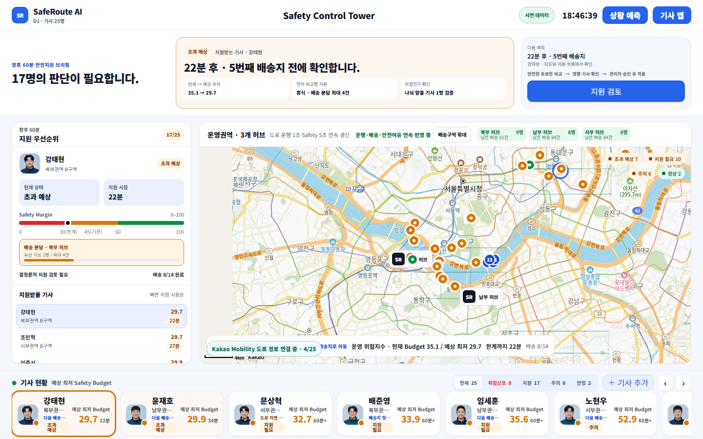
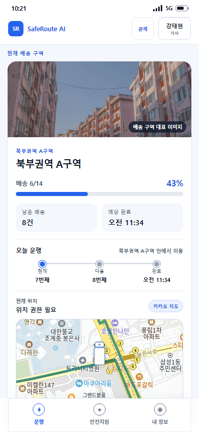

# SafeRoute AI

**남은 배송계획의 안전한계 초과를 예측하고, 기사 동의와 관리자 승인을 거쳐 계획을 조정하는 안전운영 코파일럿.**

[포트폴리오](./docs/portfolio-case-study.md) · [공개 데모](https://saferoute-ai-demo.khiyw.chatgpt.site/) · [시연 영상](./output/video/saferoute-ai-final-demo-2026-public-v2-silent.mp4) · [기술 보고서](./docs/technical-report.md) · [마감 기록·제출본 정정](./docs/portfolio-closeout.md)

2026 AI ROOKIE 참가 프로젝트를 **개인 포트폴리오 기술 데모로 마무리**했습니다. 대회 팀명은 안전빵이며, **김용우가 기획·설계·개발·모델 학습·검증·발표 전 과정을 담당**했습니다. **예선 100팀에 선정됐지만 결선에는 진출하지 못했습니다.** 실서비스나 창업으로 확대할 계획은 없습니다.

> 모든 핵심 성능 결과는 합성 데이터와 시뮬레이션 기준입니다. 사고확률, 실제 사고 감소 효과, 현장 운영 적합성을 입증한 시스템은 아닙니다.

## 해결하려 한 문제

빠른 배송계획도 작업자의 안전여유를 넘을 수 있습니다. SafeRoute는 “현재 계획을 유지하면 언제, 어느 배송지에서 한계를 넘는가?”를 계산하고, 개입이 다른 기사에게 위험을 떠넘기지 않는지 확인합니다.

**미래 한계 예측 → 원인 설명 → 개입 비교 → 위험전가 검사 → 기사 동의 → 관리자 승인 → 합성 계획 적용 → 고객안내 초안·감사기록**

<table>
  <tr>
    <td width="72%"></td>
    <td width="28%"></td>
  </tr>
</table>

2026-09-06 현재 공개 데모에서 직접 촬영한 화면입니다. 기사·배송 상태는 합성 시연 데이터이며, 지도 연동 상태와 화면별 촬영 정보는 [촬영 기록](./docs/images/portfolio-2026-09-06/capture.json)에 남겼습니다.

## 직접 설계하고 구현한 것

| 영역 | 구현과 판단 |
|---|---|
| 안전 계산 | Safety Budget·Time-to-Breach를 결정론적으로 계산하고 임계치·결측·단조성 경계를 검증 |
| 개입 비교 | 휴식·물량이관·순서변경·안전경로·Safe Delay 비교. 안전 후보만 비교 대상으로 남기는 하드 제약 |
| 위험전가 차단 | 물량을 받는 기사의 안전여유·작업용량·시간창·권역 조건을 재검증 |
| 사람의 결정권 | 영향 기사들의 동의·수정 요청·거절, 관리자 승인, 만료·버전 충돌·재검증을 상태기계로 구현 |
| AI 책임 경계 | 국내 AI의 문서 파싱·설명과 수치 계산을 분리. 스키마·숫자·인용 검증 실패 시 명시적 Fallback |
| 실험·재현성 | 합성 데이터 생성, A.X LoRA 학습·평가, 동결 비교 실험, 관리자–기사 E2E, 실패 결과까지 증거로 보존 |

핵심 앱은 **React 19, TypeScript, Vite, Zod, CSS**로 구성했습니다. 검증에는 **Vitest와 Playwright**, 공개 데모에는 **Cloudflare Workers 호환 Sites 런타임**, 모델 실험에는 **Python·A100·LoRA**를 사용했습니다.

## 확인한 결과와 한계

2026-09-05 마감 검증: **단위·계약 테스트 467개, E2E 70개, clean start 3회**. [최종 Gate 증거](./artifacts/evals/final-readiness-latest.json)

30개 동결 합성 변형에서 하드 제약 위반은 SafeRoute **0/30**, ETA 우선 **17/30**, 배송 건수 균형 우선 **11/30**이었습니다. 마지막 비교군은 기사 간 배송 건수의 최대–최소 차이를 최소화하며, 안전과 ETA를 가중합한 모델이 아닙니다. [비교 구현](./src/evals/frozenBenchmark.ts) · [비교 결과](./artifacts/evals/frozen-benchmark-summary.json)

다음 한계를 공개한 상태로 종료합니다.

- 안전 임계치와 가중치는 현장 사고 데이터로 보정되지 않았습니다.
- 물량이관은 소속·작업량·계획 버전 등을 갱신하지만, 이관 배송지의 개별 ETA·순서·도로 구간을 새로 최적화하지 않습니다.
- 관리자 공간 이해도 Round 3은 **0/6 trial**로 실패했습니다. 후속 독립 검토는 완료하지 않았으며 2.5D 표현을 기본 화면으로 승격하지 않았습니다.
- 실제 인증·TMS 쓰기·고객 메시지 발송은 연결하지 않았습니다. 고객안내는 초안입니다. 사용자가 켜는 기기 위치 표시는 메모리에서만 사용하며 서버·관리자·Safety 계산에 보내지 않습니다.

## 로컬 실행

Node.js **20.19+ 또는 22.12+**, pnpm이 필요합니다. 영상·Office 원본까지 내려받으려면 Git LFS도 설치하세요.

```bash
git lfs install
git clone https://github.com/khi6174/ai_rookie.git
cd ai_rookie
pnpm install --frozen-lockfile
pnpm dev
```

```bash
pnpm run typecheck
pnpm test
pnpm run build

# 전체 Gate: Windows PowerShell 필요
pnpm exec playwright install chromium
pnpm run verify:final
pnpm run audit:goal
```

기본 검증은 외부 API 키 없이 실행합니다. Live 연동은 [.env.example](./.env.example)과 해당 명세를 따르며 키를 저장소에 기록하지 않습니다.

## 자료 안내

- [기술 보고서](./docs/technical-report.md): 문제 정의, 구조, 계산·승인·AI 경계, 실험과 결과
- [포트폴리오 마감 기록](./docs/portfolio-closeout.md): 이번 수정, 제출본 표현 정정, 남긴 한계
- [제품 명세](./docs/product-spec.md) · [아키텍처](./docs/architecture.md) · [결정 기록](./docs/decisions.md) · [평가 계획](./docs/evals.md)
- [대회 제출 시점 v1.0.0](https://github.com/khi6174/ai_rookie/tree/v1.0.0): 당시 코드·문서 보존본
- [제출 영상](./output/video/saferoute-ai-final-demo-2026-public-v2-silent.mp4) · [최종 제안서](./2026_AI_ROOKIE_본선제안서_Team_안전빵_최종윤문본.docx)

제출 원본은 작성 당시 기록으로 보존합니다. 현재 구현과 결과를 설명할 때는 위 기술 보고서와 마감 기록을 기준으로 합니다.
