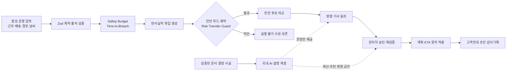
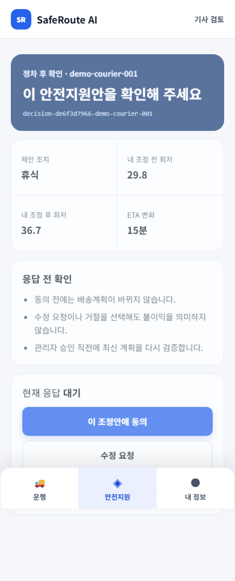

<div align="center">

# SafeRoute AI

### 미래 안전한계 예측과 위험전가 방지를 결합한 라스트마일 안전운영 코파일럿

**Technical Report · AI ROOKIE 2026 · 팀 안전빵**

[](https://github.com/khi6174/ai_rookie/tree/v1.0.0)
[](./artifacts/evals/final-readiness-latest.json)
[](./artifacts/evals/goal-completion-latest.json)
[](./artifacts/evals/unit-summary.json)
[](./artifacts/evals/final-readiness-latest.json)
[](./docs/privacy-and-ai-policy.md)

[v1.0.0 소스](https://github.com/khi6174/ai_rookie/tree/v1.0.0) · [공개 데모](https://saferoute-ai-demo.khiyw.chatgpt.site/) · [3분 시연 시나리오](./docs/final-recording-script.md) · [제품 명세](./docs/product-spec.md) · [평가 증거](./artifacts/evals/final-readiness-latest.json)

</div>

> **연구 경계.** SafeRoute AI는 사고확률·의학적 위험·기사 성과를 예측하는 시스템이 아니다. 아래 결과는 비식별 합성 데이터와 결정론적 시뮬레이션으로 얻은 소프트웨어 검증 결과이며, 실제 사고 감소나 현장 효과의 증거가 아니다.

---

## 초록

라스트마일 운영은 거리, 도착예정시간(ETA), 비용과 적재량을 최적화하지만, 현재 계획을 계속 수행할 때 기사의 운영상 안전여유가 **언제, 어느 배송지에서** 임계치를 넘는지는 계획 변경 과정에 충분히 반영하지 못한다. SafeRoute AI는 이 문제를 정적 기사 점수나 사고확률 예측이 아니라 **미래 계획 검증 문제**로 정의한다.

본 시스템은 남은 배송계획을 따라 `Safety Budget`과 `Time-to-Breach`를 결정론적으로 계산하고, 휴식·물량이관·배송순서 변경·안전경로·Safe Delay의 반사실적 결과를 비교한다. 안전하지 않은 후보는 ETA와 비용을 비교하기 전에 제외하며, 물량을 받는 기사까지 다시 계산하는 `Risk Transfer Guard`로 위험전가를 차단한다. 선택된 계획은 영향 기사들의 동의와 관리자 승인을 거친 뒤 경로·배송순서·작업량·ETA·고객안내 초안에 원자적으로 반영된다. 국내 AI 계층은 검증된 수치와 문서 근거를 역할별 언어로 설명할 수 있지만, 안전 수치·실행 가능성·추천·적용 상태를 계산하거나 덮어쓸 수 없다.

30개 동결 합성 변형의 90회 전략 비교에서 SafeRoute는 하드 제약 위반 0건을 기록했으며, Fastest-only와 Balanced-only는 각각 17건과 11건을 기록했다. 최신 저장 증거 기준으로 단위·계약 테스트 462/462, Playwright E2E 70/70, Risk Transfer 경계 23/23, 결정 상태기계 경계 30/30, clean start 3/3을 통과했다. 다만 관리자 공간 이해도 Round 3은 0/6으로 실패했고 후속 독립 검토가 완료되지 않았다. 따라서 현재 결과는 **기술 데모 제출 가능, 관리자 이해도 검증 공백 공개** 상태다.

**주요어:** 라스트마일, 안전 제약, 반사실적 계획, 위험전가, 인간 승인, 결정론적 AI, 책임 있는 AI

## 1. 연구 질문

> 아직 임계치를 넘지 않았더라도 현재 계획을 유지하면 언제, 어디서 안전한계를 넘으며, 어떤 개입이 모든 영향 기사에게 안전하고 실행 가능한가?

기존 접근이 주로 “가장 빠른 계획” 또는 “현재 위험 신호”를 묻는다면, SafeRoute는 다음 세 질문을 하나의 폐루프로 연결한다.

1. **예측:** 남은 배송계획의 어느 지점에서 운영상 안전여유가 처음 임계치를 넘는가?
2. **반사실:** 휴식·이관·순서·경로·지연 중 어느 후보가 하드 제약을 지키는가?
3. **통제:** 영향을 받는 기사와 관리자가 같은 근거로 합의했을 때만 계획을 어떻게 안전하게 갱신할 것인가?

## 2. 핵심 기여

| 기여 | 구현 내용 | 소유 계층 |
|---|---|---|
| 미래 안전 가능영역 | 배송지별 Safety Budget, 위험 밴드, Time-to-Breach, 기여요인, 신뢰도·결측 상태 | 결정론 엔진 |
| 안전 우선 최적화 | 안전하지 않은 후보를 먼저 제외하고 안전한 집합 안에서만 ETA·비용·복잡도 비교 | 개입 엔진 |
| 위험전가 방지 | 이관 후 수신 기사의 Budget·작업용량·시간창·권역 호환성을 전체 계획으로 재검증 | Risk Transfer Guard |
| 인간 통제 | 영향 기사 동의·수정 요청·거절과 관리자 승인, 만료·버전 충돌·재검증 | 결정 상태기계 |
| 원자적 적용 | 경로·순서·작업량·ETA·고객안내 초안·감사기록을 하나의 decision ID로 갱신 | Application 계층 |
| 제한된 AI 권한 | 검증된 JSON·인용을 역할별로 설명하되 계산·추천·실행 가능성은 변경 불가 | 국내 AI 근거 계층 |

## 3. 시스템 개요



관리자와 기사 화면은 서로 다른 계산을 하지 않는다. 두 화면은 같은 불변 decision snapshot과 `decisionId`를 읽으며, 설명 계층의 실패·타임아웃·문구 변화는 도메인 결과를 바꾸지 않는다.

<table>
  <tr>
    <td width="72%"></td>
    <td width="28%"></td>
  </tr>
  <tr>
    <td align="center"><sub>관리자 Calm Control Tower · 1440×900</sub></td>
    <td align="center"><sub>기사 Field-first PWA · 390×844</sub></td>
  </tr>
</table>

## 4. 방법

### 4.1 Dynamic Safety Envelope

`Safety Budget B(t)`는 0에서 100 사이의 **운영상 안전여유 지수**다. 사고확률이나 건강·성과 점수가 아니다.

```text
B(t+1) = clip(B(t) - Exposure(t, t+1) + Recovery(t, t+1), 0, 100)

Exposure = DriverExposure
         + TaskExposure
         + RouteExposure
         + WeatherExposure
         + InteractionExposure
```

| 내부 Budget | 위험 밴드 | 해석 |
|---:|---|---|
| `B ≥ 60` | 안정 | 현재 계획에 상대적 여유가 있음 |
| `45 ≤ B < 60` | 주의 | 추세와 결측 입력 확인 필요 |
| `30 ≤ B < 45` | 지원 필요 | 가까운 시점의 개입 검토 필요 |
| `B < 30` | 임계치 초과 | 현재 계획이 v1 안전 가능영역 밖으로 판정 |

`Time-to-Breach`는 최대 120분의 예측 구간에서 `B < 30`이 되는 첫 시점이다. 임계치 판정은 반올림 전 값으로 수행하며, 결측 입력이 늘어날수록 신뢰도가 높아지지 않는 단조성을 강제한다. 자세한 공식과 한계는 [Safety Budget 모델 명세](./docs/safety-model.md)에 있다.

### 4.2 안전 집합 우선 선택

후보 `a`의 안전 집합을 먼저 정의한다.

```text
A_safe = { a | sourceBudget(a) ≥ threshold
             ∧ recipientBudget(a) ≥ supportThreshold
             ∧ capacity(a) = feasible
             ∧ timeWindow(a) = feasible
             ∧ consentScope(a) = valid }
```

추천은 `A_safe` 안에서만 ETA 변화, 고객 영향, 운영복잡도를 비교한다. 따라서 안전은 다른 목표와 교환되는 가중치가 아니다. 실행 불가 후보도 숨기지 않고 차단 사유와 함께 남겨 사용자가 비교할 수 있게 한다.

### 4.3 Two-Key Consent와 원자적 적용

정상 상태는 `평가 → 후보 생성 → 기사 검토 → 영향 기사 동의 → 관리자 승인 → 최신 계획 재검증 → 원자 적용 → 감사` 순서로 진행된다. 기사에게는 동의, 수정 요청, 거절을 비징벌적 선택지로 제공한다. 동의 만료, 행위자 불일치, 계획 버전 충돌, 후보 재사용, 중요 입력 변화가 발생하면 적용을 차단한다.

### 4.4 국내 AI의 제한된 역할

결정론적 코드가 Safety Budget, 위험 밴드, Time-to-Breach, 실행 가능성, Risk Transfer Guard, 추천과 최종 적용 상태를 소유한다. Upstage·SKT A.X·LG K-EXAONE 관련 계층은 검증된 구조화 사실을 설명하거나 연구·평가 근거를 만드는 범위로 제한된다. malformed 응답, 숫자 불일치, 인용 오류, 타임아웃은 명시적인 안전 템플릿 Fallback으로 전환한다.

## 5. 실험 설계

모든 핵심 평가는 고정된 합성 fixture와 버전된 설정으로 재현한다.

- **대표 회귀 시나리오:** 우천·경사·장시간 작업, 폭염·중량물·계단, 야간·낯선 권역 3종
- **전략 비교:** 30개 frozen 변형 × Fastest-only·Balanced-only·SafeRoute = 90회
- **경계 평가:** Risk Transfer 23건, 시간·동의·버전 충돌 30건
- **문서 파이프라인:** 25개 상위 합성 레코드에서 100개 운영문서 생성·검증
- **다기사 부하:** 24명·96명·240명 합성 관제 profile
- **사람 검토:** 기사 제품 경계 Round 2, 관리자 공간 이해도 Round 3
- **릴리스 Gate:** production build, E2E, clean start 3회, 핵심 증거 재생성, 국내 AI 트랙 감사

평가 계획, 데이터 분할, 수용 기준은 [평가·검증 계획](./docs/evals.md)에서 관리한다.

## 6. 결과

### 6.1 기술 검증

| 평가 | 결과 | 저장 증거 |
|---|---:|---|
| Vitest 단위·계약 테스트 | **462 / 462** | [unit-summary.json](./artifacts/evals/unit-summary.json) |
| Playwright 관리자–기사 E2E | **70 / 70** | [final-readiness-latest.json](./artifacts/evals/final-readiness-latest.json) |
| Clean start 반복 | **3 / 3** | [final-readiness-latest.json](./artifacts/evals/final-readiness-latest.json) |
| Frozen 전략 비교 | **30 변형 · 90 비교** | [frozen-benchmark-summary.json](./artifacts/evals/frozen-benchmark-summary.json) |
| SafeRoute 하드 제약 위반 | **0건** | [frozen-benchmark-summary.json](./artifacts/evals/frozen-benchmark-summary.json) |
| Fastest-only / Balanced-only 위반 | **17건 / 11건** | [frozen-benchmark-summary.json](./artifacts/evals/frozen-benchmark-summary.json) |
| Risk Transfer 경계 | **23 / 23** | [risk-transfer-boundary-summary.json](./artifacts/evals/risk-transfer-boundary-summary.json) |
| 결정 상태기계 경계 | **30 / 30** | [decision-workflow-boundary-summary.json](./artifacts/evals/decision-workflow-boundary-summary.json) |
| 합성 운영문서 무결성 | **100 / 100** | [synthetic-operations-documents-latest.json](./artifacts/evals/synthetic-operations-documents-latest.json) |
| 다기사 관제 부하 | **3 / 3 profiles · 최대 240명** | [operations-scale-summary.json](./artifacts/evals/operations-scale-summary.json) |
| 국내 AI 트랙 저장소 감사 | **7 / 7** | [domestic-track-compliance-latest.json](./artifacts/evals/domestic-track-compliance-latest.json) |

기술 릴리스 Gate의 최신 저장 판정은 `PASSED`다. 이 판정은 동일 저장소의 결정론적 계산·계약·E2E·빌드 재현성을 뜻하며 실제 운영 승인을 뜻하지 않는다.

### 6.2 사람 검증과 공개 공백

| 연구 | 결과 | 판정 |
|---|---:|---|
| 기사 제품 경계 이해도 Round 2 | 5명 · 30/30 정답 · 중대 오인 0건 | `READY_TO_PROMOTE` |
| 관리자 공간 이해도 Round 3 | 3명 · 0/6 trial · 중대 오인 6건 | `DO_NOT_PROMOTE` |
| 합성 운영 서비스 역할별 독립 검토 | 관리자 0/3 · 기사 0/5 | `NOT_RUN` |

2.5D 공간 표현은 기본 화면으로 승격하지 않았고 2D를 유지한다. 관리자 Round 4 및 역할별 독립 검토가 완료되기 전에는 “관리자 이해도 검증 완료”, “현장 사용성 검증 완료”를 주장하지 않는다. 프로젝트의 종합 판정은 [기술 데모 제출 가능, 검증 공백 공개](./artifacts/evals/goal-completion-latest.json)다.

## 7. 재현 방법

### 요구사항

- Node.js 20+
- pnpm
- Git LFS — 영상·오디오·Office 산출물까지 내려받을 때 필요

```bash
git lfs install
git clone https://github.com/khi6174/ai_rookie.git
cd ai_rookie
pnpm install

# 빠른 로컬 검증
pnpm run typecheck
pnpm test
pnpm run build

# 전체 기술 릴리스 Gate — 외부 API 호출 없음
pnpm run verify:final

# 여섯 심사기준과 공개 검증 공백 판정
pnpm run audit:goal

# 개발 서버
pnpm dev
```

외부 API는 기본 검증에 필요하지 않다. Live smoke는 [.env.example](./.env.example)의 서버 전용 변수와 명시적 opt-in 명령이 있을 때만 실행한다. 비밀키는 저장소에 기록하지 않으며, 키 또는 일부 필드가 없을 때 부분 Live와 Demo를 섞지 않고 전체 Demo timeline으로 Fallback한다.

## 8. 저장소 구조

```text
src/domain/          Safety·개입·결정 상태기계의 순수 결정론 로직
src/application/     운영 snapshot, fleet 평가, 계획 적용과 내보내기
src/adapters/        합성 fixture, 국내 AI, 날씨·지도·교통 어댑터
src/ui/              관리자 Control Tower, 기사 PWA, Scenario Lab
server/              서버 전용 proxy와 합성 운영 저장소
tests/               Vitest 단위·계약·경계 회귀
e2e/                 Playwright 폐루프·접근성·해상도 검증
artifacts/evals/     최신 평가 결과와 검토 자극
docs/                승인 명세, 정책, ADR, 평가·데모 문서
video/remotion/      3분 제출 영상의 Remotion 소스
output/              보고서·제안서·영상 산출물
```

핵심 구현 경계는 [아키텍처](./docs/architecture.md), 지속 결정은 [ADR 기록](./docs/decisions.md), 개인정보·AI 권한은 [정책 문서](./docs/privacy-and-ai-policy.md)에서 확인할 수 있다.

## 9. 한계와 향후 연구

1. v1 가중치와 임계치는 현장 사고 라벨로 보정되지 않았다.
2. 합성 비교 결과를 실제 사고위험 또는 사고 감소 효과로 변환할 수 없다.
3. Time-to-Breach는 현재 계획과 입력이 유지된다는 조건부 예측이다.
4. 실제 기사 개인정보·GPS·TMS 쓰기·인증·고객 메시지 발송은 연결하지 않았다.
5. 기상청·TAAS Live 표본은 출처 검증과 지역 맥락에만 사용하며 Safety 입력으로 자동 승격하지 않는다.
6. 관리자 공간 이해도 재검증과 역할별 독립 사용성 검토가 남아 있다.
7. 실제 운영 전에는 조직별 임계치 보정, 노동·개인정보 검토, 동의 거버넌스와 실패 복구 검증이 필요하다.

## 10. 윤리·개인정보 원칙

- 원시 생체정보와 불필요한 정밀 이동궤적을 관리자에게 노출하지 않는다.
- 기사 순위, 징계, 보험, 보상 또는 성과평가에 사용하지 않는다.
- 안전은 ETA·거리·비용과 교환 가능한 가중치가 아니다.
- 한 기사의 위험을 다른 기사에게 옮기지 않는다.
- 기사에게 동의·수정 요청·거절·이의제기 권리를 비징벌적으로 제공한다.
- Mock·Live·Error·Fallback과 데이터 출처를 화면과 감사기록에 명시한다.
- 국내 AI 설명이 바뀌거나 실패해도 계산·실행 가능성·추천은 변하지 않는다.

## 11. 문서와 산출물

- [제품 명세](./docs/product-spec.md)
- [데이터 계약](./docs/data-contracts.md)
- [Safety Budget 모델](./docs/safety-model.md)
- [개입·승인 정책](./docs/intervention-policy.md)
- [개인정보·책임 있는 AI 정책](./docs/privacy-and-ai-policy.md)
- [아키텍처](./docs/architecture.md)
- [평가·검증 계획](./docs/evals.md)
- [최종 녹화 시나리오](./docs/final-recording-script.md)
- [최종 준비 증거](./artifacts/evals/final-readiness-latest.json)
- [공개 데모 영상](./output/video/saferoute-ai-final-demo-2026-public-v2-silent.mp4)
- [전략·디자인 매뉴얼 PDF](./SafeRoute_AI_Final_Strategy_Design_Manual_KR.pdf)

## 12. 인용

이 저장소를 연구·발표에서 참조할 때는 다음 형식을 사용할 수 있다.

```bibtex
@techreport{saferoute_ai_2026,
  title       = {SafeRoute AI: A Safety-Constrained Operations Copilot for Last-Mile Delivery},
  author      = {{Team SafetyBbang}},
  institution = {AI ROOKIE 2026},
  year        = {2026},
  type        = {Technical Report and Reproducible Demo},
  url         = {https://github.com/khi6174/ai_rookie}
}
```

---

<div align="center">

**더 빠른 길보다 먼저, 끝까지 안전한 계획.**

<sub>SafeRoute AI · 팀 안전빵 · 2026</sub>

</div>
