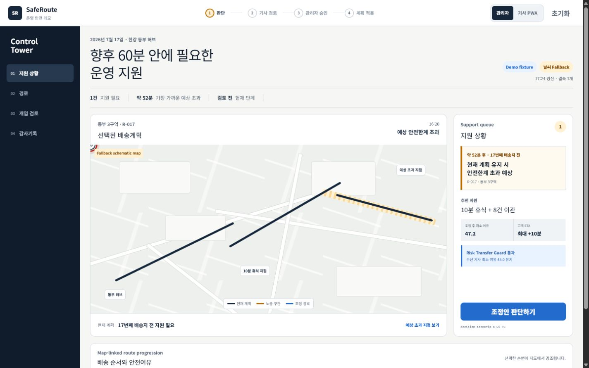
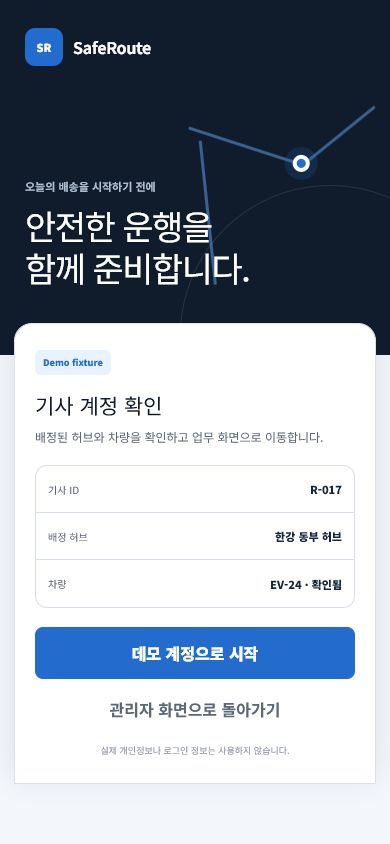
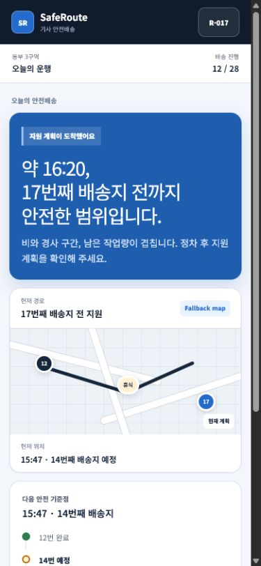
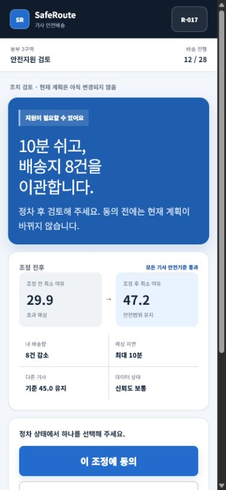

# SafeRoute AI 디자인 시스템

## 문서 상태

- 상태: Approved
- 담당: 팀 안전빵
- 최종 갱신: 2026-07-30
- 디자인 버전: `design-v2.11.0`
- 상위 문서: `AGENTS.md`, `docs/product-spec.md`, `docs/privacy-and-ai-policy.md`

## 1. 디자인 목표

SafeRoute AI의 화면은 위험을 과장하거나 기사를 감시하는 인상을 주지 않으면서, 다음 운영 결정을 빠르고 투명하게 수행하게 해야 한다.

> 무엇이 위험한가가 아니라, 언제 어떤 지원이 필요하며 어떤 조치가 모든 기사에게 안전한가를 보여준다.

디자인 성공 기준은 다음과 같다.

- 관리자가 60분 안의 지원 필요 상황을 빠르게 찾는다.
- 기사와 관리자가 같은 결정 근거를 서로에게 맞는 언어로 확인한다.
- 안전효과, 지연, 형평성과 동의 상태를 한 흐름에서 비교한다.
- 색이나 점수 하나에 의존하지 않고 상태를 이해한다.
- Demo·Live·Fallback·결측을 숨기지 않는다.
- 기사에게 동의·수정·거절을 동등하고 비징벌적으로 제공한다.
- 발표 화면과 실제 사용 화면이 같은 정보구조를 사용한다.
- 여러 지역과 여러 기사의 현재·예측 상태를 한 지도에서 집계하고 필요한 지원으로 단계적으로 좁혀 간다.
- 기사 화면은 텍스트 카드만 나열하지 않고 현재 위치, 다음 경로와 현장 맥락을 시각적으로 이해하게 한다.

## 2. 디자인 방향

### 2.1 관리자 — Calm Control Tower

- 밝은 오프화이트 작업면
- 하늘색 브랜드 헤더와 네이비 정보구조·주요 행동
- 블루는 운영 행동과 선택
- 틸은 안전 기준 통과와 안정 상태
- 앰버는 주의·지원 필요·승인 대기
- 빨강은 실제 임계치 초과와 차단에만 사용
- 지도 중심이지만 개입 큐와 비교 근거가 같은 중요도를 가짐
- 다지역 개요 → 선택 지역 → 선택 기사·decision으로 이어지는 공간적 드릴다운
- 지도 이동·확대·축소·회전과 조건부 기울이기를 지원하되 기본 카메라는 2D
- 낮은 확대 수준에서는 지역·허브·지원 상황을 군집화하고 기사 개인을 노출하지 않음
- 기사 목록이 아니라 지원이 필요한 상황 목록
- 카드 남발보다 타임라인·비교표·상태 전이를 우선

### 2.2 기사 — Field-first Human UI

- 밝고 인간적인 화면
- 한 화면에 하나의 주요 결정
- 큰 터치영역과 짧은 문장
- 점수보다 Safe-until 시각과 다음 행동 우선
- 현재 위치와 다음 배송·휴식 지점을 실제 지도 또는 명시적 schematic fallback으로 먼저 제공
- 아이콘만 반복하는 글상자형 UI를 피하고 지도, 경로, 상황 일러스트와 큰 행동을 조합
- 원인 최대 3개
- 동의·수정·거절에 위계 차별을 두지 않음
- 정차 상태에서만 자세한 검토와 입력 유도

### 2.3 발표 보조 — 제한적 Dark Map

발표 영상의 지도 확대 장면에서만 어두운 네이비 지도를 사용할 수 있다. 전체 관리자 제품을 다크·네온 상황판으로 만들지 않는다.

### 2.4 외부 레퍼런스 우선순위와 적용 범위

외부 레퍼런스는 완성 화면을 복제하기 위한 템플릿이 아니라, SafeRoute의 정보구조와 상호작용을 구체화하는 시각적 근거로만 사용한다. 원본의 로고, 아이콘, 일러스트, 지도 형태, 카드 비율과 세부 레이아웃을 그대로 복제하지 않는다.

#### 관리자 웹

| 우선순위 | 레퍼런스 | 가져올 패턴 | 가져오지 않을 요소 |
|---:|---|---|---|
| 1 | [Bridges — Logistics Fleet Delivery Control Tower Dashboard](https://dribbble.com/shots/27333427-Bridges-Logistics-Fleet-Delivery-Control-Tower-Dashboard) | 밝은 Control Tower, 큰 지도 작업면, 지도 옆 실행 큐, 절제된 운영 밀도 | 일반 배송 성과판, 기사 순위, 장식 통계, 원본 레이아웃 복제 |
| 2 | [Dynamic Map and List Based Shipment Tracking Dashboard](https://dribbble.com/shots/24796728-Dynamic-Map-and-List-Based-Shipment-Tracking-Dashboard) | 지도와 목록의 동시 선택, route progression, 선택 구간과 상세의 연결 | 단순 화물 추적 상태를 안전 판정처럼 사용하는 표현 |
| 3 | [Human-in-the-Loop AI Decision Dashboard for Logistics Operations](https://dribbble.com/shots/27513492-Human-in-the-Loop-AI-Decision-Dashboard-for-Logistics-Operations) | 후보 비교, 신뢰도·영향·설명 근거, 사람의 검토·수정·거절·승인 흐름 | AI가 최종 결정을 내리는 표현, 기사 성과지표, 다크·오렌지 팔레트와 원본 패널 복제 |

관리자 첫 화면은 1·2순위의 `map + linked queue + route progression`에 3순위의 `human review + comparison + rationale`를 결합한다. 질문은 배송 성과가 아니라 `향후 60분 안에 누구에게 어떤 지원이 필요한가`로 고정한다.

#### 기사 모바일/PWA

| 우선순위 | 레퍼런스 | 가져올 패턴 | SafeRoute 적용 위치 |
|---:|---|---|---|
| 1 | [Mobile UI Screens for Driver App](https://dribbble.com/shots/25669008-Mobile-UI-Screens-for-Driver-App) | 현재 운행 상태 우선, 다음 업무와 경로의 한눈 요약, 큰 주요 행동 | `운행` 탭의 Safe-until, 배송 진행, compact route와 검토 버튼 |
| 2 | [Field Service Dispatch Mobile App](https://dribbble.com/shots/26302643-Field-Service-Dispatch-Mobile-App) | 현장 작업 카드, 짧은 상태 흐름, 고정된 소수의 앱 내비게이션 | `운행 / 안전지원 / 내 정보` 3탭과 검토·응답 상태 전이 |
| 3 | [Drileaf — Fresh Produce Delivery Driver App Concept](https://dribbble.com/shots/26340526-Drileaf-Fresh-Produce-Delivery-Driver-App-Concept) | 브랜드 진입면, 배정 정보 확인, 명확한 시작 행동 | Demo fixture 로그인 화면에만 사용 |

#### 운영 제품 레퍼런스

| 레퍼런스 | 가져올 패턴 | 적용 화면 | 금지 경계 |
|---|---|---|---|
| [아틀란 트럭](https://play.google.com/store/apps/details?hl=ko&id=kr.mappers.atlantruck) | 지도 안에서 현재 위치·다음 지점·남은 순서와 경로 변화를 빠르게 읽는 현장형 정보구조 | 기사 `운행`의 compact map, 배송 진행, Safe-until과 다음 안전 거점 | 원본 화면·아이콘 복제, 실제 턴바이턴·교통·오더 배차·운임 기능 암시, 운전점수·기사 평가 |
| [KBS 모빌리티 AI 영상](https://www.youtube.com/watch?v=NsgIRYv0c6I&t=243s) | 예방적 안전 신호와 맞춤 피드백을 기사·관리자 행동으로 연결하는 문제 프레이밍 | 안전지원 이유, 신뢰도·결측·출처, Near-miss와 향후 선택형 신호 상태 | 자동 사고 확정·구조 요청, 상시 감시, 센서·행동 점수를 성과지표처럼 표시 |

아틀란 트럭은 기사 UX 레퍼런스이고 KBS 영상은 문제·데이터 활용 레퍼런스다. 두 레퍼런스 모두 Safety Budget 계산, 추천 순위, 동의·승인 상태기계의 근거가 아니며 외부 제품명·로고를 실제 제품 화면에 노출하지 않는다.

#### 공통 카드와 상태 컴포넌트

| 레퍼런스 | 확인 노드 | 가져올 패턴 | SafeRoute 적용 경계 |
|---|---|---|---|
| [100 card design templates UI kit — Community](https://www.figma.com/design/92BlPHdkKlsMiqt29MCRpZ/100-card-design-templates-UI-kit--Community-?node-id=416-1265&m=dev) | `416:1265`과 카드 예시 `418:1543` | 흰 작업면, 얇은 경계, 16px 안팎 모서리, 제목·근거·행동의 짧은 계층, 절제된 2단 그림자 | 기존 지도·표·폐루프 정보구조를 유지한 채 KPI, 지원 큐, 비교·기사 카드의 시각 문법에만 적용. 텍스트 카드 옆의 별도 색상 막대는 사용하지 않음 |
| [Material X design system — Community](https://www.figma.com/design/QVEOugTH7EqU3EJvujJmaq/Material-X-design-system--Community-?node-id=0-1&m=dev) | UI Kit `0:1`, Segments `687:125` | 28~40px 높이의 compact capsule, 연한 상태면, 선택 항목의 흰 면과 얕은 그림자, 텍스트로 구분되는 상태 | Segments를 그대로 사용하지 않고 상태 badge의 모서리·간격·경계·상태 대비만 전환 |

Figma 레퍼런스의 React·Tailwind 예제, 원본 로고·아이콘·이미지와 컴포넌트 파일은 복사하지 않는다. 기존 React·TypeScript와 CSS custom property 구조로 재작성하며 외부 런타임 에셋이나 새 UI 의존성을 추가하지 않는다.

3순위 레퍼런스는 실제 인증 기능의 근거가 아니다. 로그인 화면은 합성 기사 ID, 허브와 차량을 확인하는 데모 진입면이며 `실제 개인정보나 로그인 정보를 사용하지 않음`을 표시한다.

레퍼런스의 정확한 URL, 우선순위와 적용 범위가 이 표에 없으면 구현 근거로 사용할 수 없다. Dribbble·Awwwards를 포함한 추가 레퍼런스는 원본 복제가 아니라 `가져올 패턴 / 금지 요소 / 적용 화면`을 기록하고 사용자 승인을 받은 뒤에만 이 목록에 추가한다.

### 2.5 디자인 근거 캡처

아래 이미지는 외부 작품의 복사본이 아니라, 2.4의 패턴을 SafeRoute 언어와 가드레일로 재해석한 격리형 디자인 프로토타입 캡처다. 구현 수용기준이나 실제 운영 연동 증거로 사용하지 않는다.

| 캡처 | 확인할 디자인 의도 | 파일 |
|---|---|---|
| 관리자 Control Tower · 1440×900 | 지도 60%, 지원 큐 40%, Time-to-Breach와 Fallback 표시 | [`reference-admin-control-tower-1440x900.png`](design-references/reference-admin-control-tower-1440x900.png) |
| 기사 Demo 로그인 · 390×844 | 3순위 레퍼런스를 진입면에만 제한하고 실제 인증으로 오인하지 않음 | [`reference-rider-login-390x844.png`](design-references/reference-rider-login-390x844.png) |
| 기사 운행 · 390×844 | Safe-until 우선, compact route, 배송 진행, 앱형 정보 밀도 | [`reference-rider-route-390x844.png`](design-references/reference-rider-route-390x844.png) |
| 기사 안전지원 · 390×844 | 한 화면 한 결정, 전후 비교, 동의·수정·거절의 비징벌적 제공 | [`reference-rider-support-390x844.png`](design-references/reference-rider-support-390x844.png) |









캡처 메타데이터:

- 확인일: 2026-07-18
- 데이터 상태: `Demo fixture`, 날씨·지도 `Fallback`
- 프로토타입: `artifacts/saferoute-web-demo`, 별도 nested repository
- 격리형 미리보기: 제품 런타임·최종 제출물에서 제외하며 외부 주소를 최종 문서에 노출하지 않는다.
- 범위: 디자인 참고만 허용하며 Safety Budget, 개입 판정, 동의·승인 상태기계와 실제 SafeRoute 구현을 대체하지 않음

### 2.6 디자인 문서 반영 경계

이 버전은 색상, 정보 우선순위, 화면 구성, 내비게이션, 다지역 지도 상호작용과 기사 PWA의 최종 시각 목표를 확정한다. 다음 항목은 목표로 승인되었더라도 이 문서 갱신만으로 바로 구현하지 않는다.

- Safety Budget·Time-to-Breach 계산과 임계치
- 개입 후보, Risk Transfer Guard와 추천 순위
- 원 기사·수신 기사 동의와 관리자 승인 상태기계
- 실제 인증·위치·푸시·서버 동기화가 결합된 PWA 확장
- 실제 인증, 별도 기사 세션과 권한 모델
- ADR-043에서 승인한 Kakao 2D 표시 어댑터를 넘어선 주소검색·길찾기·3D, TMS·알림·위치 스트림 실연동
- 실시간 위치의 수집주기, 정밀도, 보존기간과 권한
- 새로운 외부 UI·지도·아이콘 의존성

실제 화면 반영은 `product-spec`, `data-contracts`, `privacy-and-ai-policy`, `architecture`의 관련 경계를 먼저 갱신·승인하고 기존 테스트·폐루프를 보존하는 별도 구현 작업으로 수행한다. 디자인 목표 승인은 실제 위치 추적이나 외부 공급자 계약을 자동 승인하지 않는다.

### 2.7 실제 데모 반영 상태

2026-07-18 별도 구현 작업에서 2.4~2.6의 허용 범위를 실제 React 데모에 이식했다. 기사 모바일 웹에는 실제 인증이 아닌 Demo 계정 확인, Safe-until 중심 운행 화면, 조치 중심 안전지원 화면, `운행 / 안전지원 / 내 정보` 3탭과 compact Fallback map을 적용했다. Safety 계산, 개입 판정, 동의·승인 상태기계와 외부 의존성은 변경하지 않았다.

2026-07-19 G2-A에서 관리자 지도를 공급자 독립 기능형 SVG 2D 지도 작업면으로 교체했다. 최초 화면은 3개 합성 지역의 집계만 표시하고, 지역을 선택하면 해당 지역 8명의 current·stale·offline 상태와 경로가 나타나며, 기사를 선택하면 같은 `decisionId` 상세로 좁혀진다. breadcrumb와 `전체 보기`, 지원 큐의 `지도에서 같은 decision 보기`가 동일 선택을 공유한다. 화면에는 `결정론적 합성 위치`, `Live 0명`, `Demo movement 아님`을 명시한다.

같은 날 G2-B에서 정상 지도 아래에 키보드로 펼칠 수 있는 구조화 대안을 추가했다. Demo의 `지도 오류 재현` 상태에서는 빈 지도 대신 지역 집계, 기사·위치 최신성, decision 선택과 배송순서·지원 조치 목록이 자동으로 열린다. `지도 복구` 후에도 선택한 decision을 유지하며, 정상 지도와 Fallback은 같은 `MapAdapter` 결과만 읽는다.

2026-07-20 G2-C에서 공급자 독립 합성 지도에 bounded pan을 추가했다. 관리자는 빈 지도 영역을 포인터로 끌거나 지도에 포커스한 뒤 방향키로 이동할 수 있고, `Home`·`0` 또는 `지도 중심 복원`으로 원위치한다. 이동 범위는 화면 안의 Demo 맥락을 잃지 않도록 가로 160px·세로 110px로 제한하며, 합성 지형 배경·격자·경로·마커는 하나의 surface로 함께 이동한다. 데이터 모드·decision·조작 안내는 고정 overlay로 분리한다. 이 기능은 합성 위치를 움직이거나 실제 지도 공급자 동작을 가장하지 않는다.

2026-07-21 G5-B Round 1 사람 이해도 평가에서 2D·2.5D 모두 결정 목적, 경사 구간, 두 기사 영향과 경로 순서를 충분히 전달하지 못했다. 따라서 관리자 활성 decision의 첫 정보위계를 `지금 답할 질문 → 현재·휴식·경사·지원 완료 순서 → 두 기사 영향 → 이유 → 동의·승인 상태`로 고정한다. 2.5D는 기본 화면이나 주요 행동이 아니라 `경사 근거 자세히 보기 · Demo 2.5D` 보조 상세로 낮춘다. Round 2·3에서도 시간·배송지·경로 우선순위와 양측 영향의 동시 이해가 통과하지 못했으므로 Round 4부터 화면의 `원 기사`는 `지원받는 기사`, `수신 기사`는 `배송을 나눠 맡는 기사`로 풀어 쓴다. 첫 결론은 `약 52분 후 17번째 배송지 전에, 10분 휴식과 배송 8건 이관이 필요합니다`로 고정하고, 두 기사 결과를 바로 다음 문장에 함께 표시한다. 내부 계약의 `SOURCE`·`RECIPIENT` 역할과 Safety 계산은 바꾸지 않으며 모든 과거 round 증거를 별도 파일로 보존한다.

기사 운행의 지원 계획 요약은 큰 경고성 문장 하나를 전면에 두지 않는다. `지원 계획 상태 → 전체 너비의 짧은 안내 → Safe-until 시각 → 현재·다음 조치·지원 시점`의 순서로 구성하고, 핵심 시각은 16:20과 약 52분을 함께 보여준다. 안내 문장은 시간 블록 옆의 좁은 열에 배치하지 않는다. 상세 원인은 짧은 보조문으로 낮추며 동일한 정보가 아래 경로 지도와 중복되지 않도록 한다.

2026-07-23 기사 Round 1 사람 평가에서 경로 수치는 이해했지만 제품 역할·승인 규칙의 중대 오인이 2명 발생했다. 기사 첫 운행 화면은 `합성 Demo 경로 · GPS 길안내 아님`을 상단에 직접 표시하고, 지원 설명은 `미래 안전한계 예측·지원계획 합의. 기사 동의 → 관리자 승인 후에만 적용`을 두 줄 안에서 읽히게 유지한다. 이 경계는 별도 장식 카드로 화면을 늘리지 않으며 390×844·360×800에서 핵심 행동이 고정 탭 위에 남아야 한다.

G3-A에서 기사 모바일 웹의 첫 화면을 Field-first 순서로 다시 구성했다. 운행은 Safe-until·다음 배송을 hero 안에서 즉시 보여주고, 합성 현재 위치·강수·경사·휴식 지점이 있는 compact Fallback map과 큰 안전지원 행동을 첫 화면에 배치한다. 안전지원은 조정 전후·내 작업 변화·현재 계획 불변 안내와 동의·수정·거절을 상세 카드보다 먼저 둔다. 내 정보는 공유·비공유·기사 권리를 세 개의 비식별 시각 타일로 요약한다.

2026-07-27 합성 운영 서비스에서는 디자인 미리보기와 기능 화면의 분리를 해소했다. 관리자 `/operations`는 `일일 운영 / 지원 상황 / 경로 / 개입 검토 / 감사·내보내기` 다섯 탭을 실제 문서 입력·전체 기사 평가·Kakao 지도·개입·D1·Upstage·내보내기 기능에 연결한다. 기사 `/operations/rider`는 `운행 / 안전지원 / 내 정보` 세 탭을 같은 decision과 저장 상태 위에서 전환한다. 사이드바 라벨만 바뀌는 단일 긴 페이지는 최종 서비스 정보구조로 사용하지 않는다.

일일 운영의 파일 입력 행동은 내부 형식 이름을 나열하지 않고 `운영 문서 첨부`로 표시한다. 개입 검토의 생성 행동은 공급자 이름이 아니라 역할을 설명하는 `AI 근거 설명 생성`으로 표시하며, 실제 공급자와 Live·Mock·Fallback 상태는 결과 상태와 감사 근거에서 별도로 밝힌다. 주요 행동 문구는 버튼 안에서 줄바꿈하지 않고 가운데 정렬한다.

2026-07-28 지원 상황에는 25명 가명 기사 마커와 `완료/전체 배송 건수`를 함께 표시한다. 앰버는 지원 검토가 가능한 마커에만 사용하고 다른 마커도 배송 진행 수치를 유지한다. 지도 상단의 `합성 스냅샷 · Live 0명`과 하단의 `실제 GPS 아님·자동 이동 아님` 설명은 숨기거나 Live 스타일로 바꾸지 않는다.

G3-B에서 기사 화면을 설치 가능한 PWA app shell로 확장했다. 온라인·오프라인·캐시 만료·저장 계획 없음 상태를 색과 텍스트로 함께 표시하고, 내 정보에 실제 설치 가능 상태, 30분 TTL과 `실제 인증·위치·푸시 미포함` 경계를 제공한다. 오프라인 승인 계획은 읽기 전용이며 모든 응답 행동을 비활성화한다.

국내 AI 트랙 범위와 라이선스 근거가 없는 외부 이미지·아이콘은 넣지 않았다. PWA 아이콘은 저장소의 결정론적 로컬 스크립트로 생성한 기하학적 route mark이며 외부 AI·에셋을 사용하지 않는다. 실제 지도·Live 위치·인증처럼 표현하지 않는다.

관리자 지도는 `design-v2.0.0`의 G2 범위와 bounded pointer·keyboard pan에 더해 ADR-043의 선택적 Kakao Maps 2D 베이스 레이어를 반영한다. 실제 지도 위에는 결정론적 합성 지역·경로·지원 마커만 표시하고 `Kakao map · Demo overlay`를 고정 표기한다. SDK·도메인·네트워크 실패 시 기존 schematic 지도와 구조화 목록으로 자동 복귀하며 `Kakao 오류 · Fallback map`을 표시한다. 기사 화면은 ADR-044에 따라 같은 decision의 합성 현재 위치·휴식 지점·다음 배송지를 작은 Kakao 2D 지도에 표시하고 `Kakao map · Demo route`를 고정 표기한다. 오프라인·SDK 오류·키 미설정에서는 기존 compact schematic과 구조화 경로 목록으로 자동 복귀한다. 실제 Live 위치·인증·푸시·서버 동기화는 미구현이다.

실제 E2E 캡처:

- [`admin-initial-1440x900.png`](../artifacts/evals/screenshots/admin-initial-1440x900.png)
- [`rider-login-390x844.png`](../artifacts/evals/screenshots/rider-login-390x844.png)
- [`rider-source-route-390x844.png`](../artifacts/evals/screenshots/rider-source-route-390x844.png)
- [`rider-source-review-390x844.png`](../artifacts/evals/screenshots/rider-source-review-390x844.png)

### 2.8 최종 디자인 목표와 변경통제

최종 완성본은 `다지역·다기사 지리공간 Control Tower + 현장형 기사 PWA`로 고정한다.

- 관리자는 전국·권역 개요에서 지역, 허브, 기사와 decision으로 점진적으로 좁혀 간다.
- 현재 위치와 남은 경로, 향후 임계치 초과, 날씨·도로·집계 Near-miss와 지원 후보를 지도 레이어로 결합한다.
- 실시간 이동은 검증된 Live 위치가 있을 때만 표현하고 Demo·Fallback에서는 실제 이동처럼 가장하지 않는다.
- 기사는 현재 위치 지도, 다음 배송·휴식 지점, 상황 이미지 또는 일러스트, 큰 단일 행동을 중심으로 본다.
- 3D는 지형·고도·도심 구조·겹친 경로를 이해하는 데 도움이 되는 지리공간 표현으로만 허용하고 장식 목적의 3D 차트는 금지한다.
- 사람의 동의·수정·거절·승인과 Risk Transfer Guard가 항상 AI 추천보다 우선한다.

이 방향을 바꾸려면 단순 취향이나 구현 편의를 이유로 직접 수정하지 않는다. 변경 제안은 `문제 / 사용자 근거 / 안전·개인정보 영향 / 대안 / 테스트 영향 / 승인자`를 기록하고 `docs/decisions.md`의 새 ADR과 사용자 승인을 거쳐야 한다. 지도 공급자, 라이선스, PWA 보안 같은 미결 구현 수단은 이 목표를 훼손하지 않는 범위에서만 선택한다.

## 3. 디자인 원칙

### 3.1 지원 중심

- `고위험 기사`보다 `지원 필요 상황`
- `기사 점수`보다 `현재 계획의 안전여유`
- `문제 기사`보다 `조정이 필요한 계획`

### 3.2 안전한 행동 우선

위험 경고보다 실행 가능한 행동과 다음 승인 단계를 가까이 배치한다.

### 3.3 같은 근거, 다른 언어

관리자와 기사 화면은 같은 `decisionId`, 수치와 상태를 사용한다. 관리자는 운영 영향, 기사는 본인의 행동과 효과를 먼저 본다.

### 3.4 불확실성 공개

신뢰도, 결측값, 데이터 출처와 Demo/Fallback 상태를 보조정보가 아니라 결정 근거로 표시한다.

### 3.5 비징벌성

거절·수정·이의제기는 오류나 위험행동처럼 표시하지 않는다. 빨간색, 경고 아이콘, 위협 문구를 사용하지 않는다.

### 3.6 절제된 밀도

관리자 화면은 정보밀도가 높지만 시각적 장식을 줄인다. 기사 화면은 정보량 자체를 줄인다.

## 4. 디자인 토큰

구현 시 CSS custom properties 또는 Tailwind theme의 단일 토큰으로 관리한다. 컴포넌트에서 임의 hex·간격·shadow를 직접 추가하지 않는다.

### 4.1 색상

#### 중립색

| 토큰 | 값 | 용도 |
|---|---|---|
| `--color-canvas` | `#F5F7FB` | 전체 배경 |
| `--color-surface` | `#FFFFFF` | 카드·패널 |
| `--color-surface-subtle` | `#F1F4FA` | 보조 행·비활성 영역 |
| `--color-navy-950` | `#101C2C` | 관리자 내비게이션 |
| `--color-navy-900` | `#16263B` | 구조적 헤더 |
| `--color-text` | `#172033` | 기본 본문 |
| `--color-text-muted` | `#5C6878` | 보조정보 |
| `--color-text-disabled` | `#8B95A3` | 비활성 텍스트 |
| `--color-border` | `#D7DEEF` | 기본 경계 |
| `--color-border-strong` | `#AAB7D4` | 강조 경계 |
| `--color-brand-sky` | `#00BFFF` | 관리자 전역 브랜드 헤더·선택 강조 |
| `--color-brand-sky-soft` | `#E0F7FF` | 선택 탭·보조 브랜드 배경 |
| `--color-brand-header-ink` | `#101828` | 하늘색 헤더의 글자·아이콘 |

관리자 전역 헤더는 승인된 시각 방향에 따라 `#00BFFF` 위에 `#FFFFFF`
로고·서비스명·계정 글자를 사용한다. 전역 헤더의 `Demo fixture`,
`기상 데이터 Fallback`, `Live 0명` badge는 제거하되, 각 지도·AI 결과·
데이터 경계 카드에서는 해당 출처 상태를 계속 명시한다.
하늘색은 브랜드·탐색·선택을 뜻하며 안정·주의·임계치 상태를 대신하지 않는다.

#### 행동·상태색

| 토큰 | 값 | 용도 |
|---|---|---|
| `--color-teal-700` | `#0B8F43` | 안정 상태·경로 텍스트 |
| `--color-teal-800` | `#087334` | 안정 상태 hover·강조 |
| `--color-teal-100` | `#E7FFEF` | 안정 배경 |
| `--color-blue-800` | `#041C91` | hover·고대비 정보 텍스트 |
| `--color-blue-700` | `#0628C7` | 기본 운영 행동·링크·선택 |
| `--color-blue-200` | `#C6D0FF` | 정보 badge·선택 경계 |
| `--color-blue-100` | `#E9EDFF` | 선택·정보 배경 |
| `--color-amber-800` | `#7A4300` | 주의·지원 필요 텍스트 |
| `--color-amber-600` | `#B76A00` | 강조선·아이콘 |
| `--color-amber-100` | `#FFF1D2` | 주의 배경 |
| `--color-red-700` | `#B42318` | 임계치 초과·차단 |
| `--color-red-100` | `#FDE9E7` | 초과 배경 |
| `--color-green-500` | `#0FE75A` | 동의·승인·계획 적용 완료의 점·강조선만 사용 |
| `--color-green-700` | `#087A36` | 완료 상태의 접근 가능한 텍스트 |
| `--color-green-100` | `#E6FFEF` | 완료 배경 |

#### 데이터 모드색

| 상태 | 배경 | 텍스트 | 아이콘·문구 |
|---|---|---|---|
| Live | `#E6FFEF` | `#087A36` | 원형 체크 + `Live` |
| Demo | `#E9EDFF` | `#041C91` | 플라스크 + `Demo fixture` |
| Fallback | `#FFF1D2` | `#7A4300` | 전환 화살표 + `Fallback` |
| Error | `#FDE9E7` | `#B42318` | 경고 삼각형 + `연결 오류` |
| Stale | `#F0F3F5` | `#5C6878` | 시계 + `업데이트 필요` |

색상만으로 상태를 전달하지 않고 텍스트와 아이콘을 항상 함께 사용한다.

### 4.2 Safety Budget 밴드 표현

| 밴드 | 기본 표현 | 색 역할 | 아이콘 |
|---|---|---|---|
| `STABLE` | 안정 | 틸 | 방패 체크 |
| `CAUTION` | 주의 | 옅은 앰버 | 눈 아이콘 |
| `SUPPORT_NEEDED` | 지원 필요 | 진한 앰버 | 손·도움 아이콘 |
| `BREACHED` | 임계치 초과 | 빨강 | 정지 원형 |

`SUPPORT_NEEDED`는 빨강을 사용하지 않는다. 예상 초과와 현재 초과도 구분한다.

### 4.3 타이포그래피

권장 font stack:

```css
font-family:
  "Pretendard Variable",
  Pretendard,
  "Noto Sans KR",
  "Apple SD Gothic Neo",
  "Segoe UI",
  sans-serif;
```

외부 CDN 폰트에 런타임을 의존하지 않는다. Pretendard를 포함할 경우 라이선스와 번들 크기를 확인하고 자체 호스팅한다.

| 토큰 | 크기/행간 | 굵기 | 용도 |
|---|---|---:|---|
| `display` | 32/40 | 700 | 발표·기사 핵심 상태 |
| `h1` | 24/32 | 700 | 페이지 제목 |
| `h2` | 20/28 | 700 | 주요 패널 |
| `h3` | 16/24 | 700 | 카드·섹션 |
| `body-lg` | 16/26 | 500 | 기사 주요 설명 |
| `body` | 14/22 | 400 | 관리자 본문 |
| `body-strong` | 14/22 | 600 | 표·강조 |
| `caption` | 12/18 | 400 | 보조정보 |
| `label` | 12/16 | 600 | 상태·필드 라벨 |
| `metric` | 28/34 | 700 | 핵심 지표 |

- 기사 모바일/PWA 본문은 기본 16px 이상을 사용한다.
- 숫자 열은 tabular numbers를 사용한다.
- 긴 한국어 복합명사는 임의 축약보다 두 줄 표시를 우선한다.
- 본문 대문자·자간 확장을 과도하게 사용하지 않는다.

### 4.4 간격

4px 기반 scale:

```text
1: 4px
2: 8px
3: 12px
4: 16px
5: 20px
6: 24px
8: 32px
10: 40px
12: 48px
16: 64px
```

- 관리자 카드 내부: 16~20px
- 관리자 주요 패널 사이: 16px
- 기사 화면 좌우 여백: 20px, 360px에서는 최소 16px
- 기사 섹션 사이: 24~32px

### 4.5 모서리와 경계

| 토큰 | 값 | 용도 |
|---|---:|---|
| `radius-sm` | 6px | 작은 태그·입력 |
| `radius-md` | 10px | 버튼·기본 카드 |
| `radius-lg` | 14px | 지도 내부·모달 |
| `radius-card` | 16px | 관리자·기사 주요 카드 |
| `radius-full` | 999px | 상태 pill |

- 기본 경계: 1px solid border
- 선택·포커스: 2px
- 중요한 상태는 카드 측면의 색상 막대가 아니라 상태 badge·아이콘·명시적 텍스트를 함께 사용한다.

### 4.6 그림자

```text
shadow-sm: 0 1px 2px rgba(16, 28, 44, 0.06)
shadow-card: 0 1px 2px rgba(6, 40, 199, 0.07), 0 10px 28px rgba(16, 28, 44, 0.07)
shadow-md: 0 8px 24px rgba(6, 40, 199, 0.10)
shadow-modal: 0 20px 60px rgba(16, 28, 44, 0.18)
```

운영 패널은 경계 중심으로 구분하고 그림자를 남용하지 않는다.

### 4.7 상태 badge

- 기본 높이 28px, 모바일 밀집 영역은 최소 26px, 좌우 여백 8~10px, 모서리 12px를 사용한다.
- 상태명과 함께 7px 상태점을 제공해 색만으로 구분하지 않는다.
- `#0628C7` 계열은 선택·정보·운영 행동, `#0FE75A`는 동의·승인·적용 완료의 작은 점과 강조선에만 사용한다.
- 밝은 `#0FE75A` 위에 본문을 직접 올리지 않고 완료 텍스트는 `#087A36`을 사용한다.
- 대기·주의는 앰버, 실제 임계치 초과·실행 차단만 빨강, 수정·거절은 중립색을 사용한다.
- 텍스트 카드의 좌·우 측면에 상태색 띠를 붙이지 않는다. 카드 구조는 중립 경계로 유지하고 상태는 badge 안에서 표현한다.

### 4.8 아이콘

- 하나의 선형 아이콘 시스템을 사용한다.
- 기본 20px, 작은 상태 16px, 기사 주요 행동 24px
- stroke 1.75~2px
- 아이콘만 있는 버튼에는 접근 가능한 이름과 tooltip을 제공한다.
- 사람 얼굴·프로필 사진은 운영상 필요하지 않으면 사용하지 않는다.

## 5. 반응형 기준

### 5.1 기준 해상도

- 관리자 표준: 1440×900
- 관리자 발표: 1280×720
- 기사 표준: 390×844
- 기사 최소: 360×800

### 5.2 breakpoint

```text
sm: 360px
md: 768px
lg: 1024px
xl: 1280px
2xl: 1440px
```

### 5.3 관리자 1440×900

```text
좌측 내비게이션: 216px
상단 바: 64px
본문 여백: 20px
지도·분석 영역: 가용폭 약 60%
개입 큐: 380px
하단 상세 패널: 260~300px
```

전국·다지역 개요에서는 지도를 주 작업면으로 유지하고 지역 요약은 지도 위 고정 패널 또는 우측 큐에 둔다. 선택 지역으로 진입해도 상위 지역 breadcrumb와 카메라 초기화 행동을 잃지 않는다.

### 5.4 관리자 1280×720

- 내비게이션을 72px 아이콘형으로 축소한다.
- 개입 큐는 340~360px를 유지한다.
- 하단 상세는 탭 또는 220px 패널로 줄인다.
- KPI는 4개를 한 줄에 유지하되 설명을 축약한다.
- 핵심 승인·전후 정보가 세로 스크롤 아래로 완전히 밀리지 않게 한다.

### 5.5 기사 모바일

- 한 열
- 상단에 현재 위치·다음 지점이 보이는 지도 또는 시각 장면을 배치하고 Safe-until과 상태를 같은 첫 화면에 유지
- 텍스트 카드가 연속으로 화면을 채우지 않도록 지도·경로·일러스트와 짧은 상태 블록을 교차 배치
- 주요 행동은 화면 하단의 safe-area 위에 배치할 수 있다.
- 작은 화면에서도 동의·수정·거절 모두 접근 가능해야 한다.
- 가로 스크롤 표를 사용하지 않는다.

## 6. 관리자 정보구조

### 6.1 좌측 내비게이션

1. Control Tower
2. Routes
3. Drivers
4. Interventions
5. Near-miss Map
6. Reports
7. Privacy/Audit

P0에서는 Control Tower, 개입 비교·승인과 Privacy/Audit 최소 화면만 실제 동작한다. 비구현 메뉴는 완성된 기능처럼 보이지 않게 `준비 중` 또는 숨김 처리 원칙을 결정한다.

### 6.2 상단 바

- 전국·권역·지역·허브 선택과 breadcrumb
- 현재 날짜·시각과 시간대
- 날씨 요약
- 데이터 모드
- 최신 갱신시각
- 알림 또는 오류 상태
- Demo 리셋

데이터 모드 배지는 항상 보이고 스크롤로 사라지지 않는다.

### 6.3 KPI strip

다음 4개만 기본 사용한다.

- 지원 필요 상황
- 60분 내 임계치 초과 예상
- 고위험 배송 후보
- 승인 대기 개입

KPI는 기사를 순위화하지 않고 클릭 시 해당 상황으로 필터링한다. 증감 화살표는 실제 비교기간이 없으면 사용하지 않는다.

### 6.4 메인 영역

- 지도·경로: 60%
- 개입 큐: 40% 또는 고정 380px
- 선택 항목 상세: 하단 또는 drawer

지도를 장식 배경으로 쓰지 않는다. 지도에서 선택한 구간과 큐의 동일 decision을 양방향 강조한다.

기본 탐색 계층은 다음과 같다.

1. 전국·권역 개요: 지역별 지원 필요 건수, 데이터 최신성과 운영 상태를 군집으로 표시
2. 선택 지역: 허브, 운행 중 기사 군집, 계획 경로와 지원 필요 decision을 표시
3. 선택 기사·decision: 현재·대안 경로, Time-to-Breach, 후보 비교와 승인 근거를 연결

낮은 확대 수준에서 기사 마커를 개별 표시하지 않는다. 선택 범위가 좁아져 운영상 필요할 때만 가명 기사 ID와 파생 상태를 표시한다.

### 6.5 선택 기사 상세

- 현재 Safety Budget 범위와 밴드
- Safe-until·Time-to-Breach
- 배송지별 타임라인
- 원인 기여도
- 신뢰도·결측·데이터 출처
- 현재 계획 버전

기사 상세는 성과 프로필이 아니다. 과거 거절률, 순위, 누적 위험점수는 표시하지 않는다.

## 7. 기사 PWA 정보구조

최종 목표는 설치 가능한 현장형 기사 PWA다. 현재 공개 데모는 설치 가능한 정적 app shell과 30분 승인 Demo 계획 캐시를 제공하지만 실제 인증·위치·푸시·서버 동기화는 주장하지 않는다. 하단 주요 탭은 `운행 / 안전지원 / 내 정보` 세 개로 고정하고 세부 상태를 별도 탭으로 늘리지 않는다.

### 7.1 운행

1. 현재 위치, 진행 방향과 다음 배송지를 보여주는 지도 작업면
2. 오늘의 안전배송, 배송 진행과 Safe-until
3. 현재 위치·휴식 지점·다음 배송지를 잇는 compact route
4. 날씨·정차·경로변경처럼 현재 맥락을 설명하는 일러스트 또는 이미지
5. 적용된 다음 계획 또는 검토할 지원안
6. 안전지원 검토 버튼

온라인이며 Kakao SDK가 정상인 Demo에서는 compact route에 `Kakao map · Demo route`를 표시한다. 좌표는 현재 decision에서 파생한 결정론적 합성 데이터이며 실제 GPS가 아니다. 공급자 오류·키 미설정·오프라인에서는 `Fallback map`과 동일한 구조화 경로 목록을 제공한다. 운전 중 복잡한 전체 지도나 긴 입력을 요구하지 않는다.

카카오모빌리티 Directions가 정상인 경우 compact route 아래에 `자동차 길찾기 · 합성 Demo`, 예상 거리·시간·휴식 지점과 `카카오맵에서 Demo 길찾기` 단일 행동을 표시한다. 외부 응답은 합성 세 지점의 경로선과 미리보기 수치만 바꾸며 Safety·배송순서·승인 상태는 바꾸지 않는다. 로딩·오류·오프라인에서는 같은 카드 안에서 `Demo 경로로 계속`을 표시하고 기존 경로·목록을 유지한다. 버튼과 링크는 최소 48px이며 실제 GPS가 아니라는 문구를 카드 안에 고정한다.

### 7.2 안전지원

- 추천 조치 요약
- 조정 전후
- 내 작업·ETA 변화
- 다른 기사 안전기준 통과 여부
- 신뢰도·결측
- 응답 상태와 관리자 다음 단계
- 동의·수정 요청·거절

한 화면에서 하나의 결정을 완료한다. 변경 전에는 현재 계획이 유지되고, 적용 후에는 승인된 계획과 ETA가 반영됐음을 명확히 표시한다.

### 7.3 내 정보

- 사용 데이터 범위
- 관리자에게 보이는 파생 상태
- 공유하지 않는 원시·정밀 데이터
- 이의제기·정정·도움 경로
- Demo fixture 계정과 실제 인증이 아님을 알리는 문구

Near-miss는 P1 기능으로서 `내 정보`의 도움 경로에서 안내할 수 있으나, P0 하단 탭이나 완성된 기능처럼 표시하지 않는다.

### 7.4 시각 자산 원칙

- 일러스트와 이미지는 `현재 위치`, `다음 행동`, `날씨·노면`, `정차·휴식`, `안전지원 결과`를 더 빨리 이해하게 할 때만 사용한다.
- 사진·3D 에셋·지도 스타일은 출처, 라이선스와 생성 도구를 기록하고 국내 AI 트랙 성과 범위를 별도로 표시한다.
- Dribbble·Awwwards 레퍼런스의 원본 이미지, 캐릭터, 아이콘과 레이아웃을 복사하지 않는다.
- 장식 이미지가 Safe-until, 데이터 최신성, Demo·Fallback 배지나 주요 행동을 밀어내면 안 된다.
- 사람 얼굴이나 프로필 사진은 개인 식별에 필요하지 않으므로 기본 사용하지 않는다.
- 이미지가 없거나 로드되지 않아도 대체 텍스트와 구조화된 경로 요약으로 같은 결정을 완료할 수 있어야 한다.

## 8. 핵심 컴포넌트

### 8.1 DataModeBadge

표시 내용:

- 아이콘
- `Live`, `Demo fixture`, `Fallback`, `연결 오류`, `업데이트 필요`
- tooltip 또는 상세에서 출처·최신시각

badge를 작은 색점으로만 표현하지 않는다.

### 8.2 SafetyStatus

구성:

- 밴드 라벨
- Budget 범위 또는 지수
- Safe-until
- 예상 초과 배송지
- 신뢰도

금지:

- 단독 원형 게이지
- 백분율만 크게 표시
- 다른 기사와 비교

### 8.3 KPI Card

- 라벨
- 값
- 명확한 상태 보조문구
- 필터 동작
- 마지막 갱신

카드 전체가 버튼이면 키보드 focus와 pressed 상태를 제공한다.

### 8.4 Intervention Queue Item

- 지원 시급도
- `약 52분 후` 같은 시간
- 예상 배송지
- 추천 조치
- 기사 응답 상태
- 실행 가능성
- 데이터 모드

기본 정렬은 임계치까지 남은 시간과 운영상 시급도이며 기사 점수순이 아니다.

### 8.5 Budget Timeline

- x축: 시각·배송순서
- y축: Safety Budget
- 30 임계선과 45 지원선
- 현재 시점
- 예상 초과 지점
- 개입 전후 비교
- hover·focus 상세

선 색상만으로 전후를 구분하지 않고 실선·점선, 라벨과 범례를 함께 사용한다.

### 8.6 Contribution List

- 상위 3개 기본 노출
- 요인명
- Budget 소진 기여점
- 근거 입력
- 전체 보기

pie·donut보다 정렬된 수평 목록을 우선한다. 인과관계처럼 표현하지 않는다.

### 8.7 Intervention Comparison

각 후보의 열 또는 카드에는 같은 순서로 표시한다.

1. 조치명
2. 초과 해소 여부
3. 최소 Budget 전후
4. ETA 변화
5. 수신 기사 영향
6. 고객영향
7. 운영복잡도
8. 동의 요구
9. 실행 가능성·불가능 사유

추천안은 `추천` 라벨과 구조적 강조를 사용한다. 가장 빠른 안과 가장 안전효과가 큰 안도 필요 시 보조 라벨로 표시한다.

### 8.8 Infeasible Candidate

- 숨기지 않는다.
- 낮은 opacity만으로 비활성화하지 않는다.
- 차단 아이콘과 명확한 이유를 표시한다.
- 세부 근거는 펼쳐볼 수 있다.
- 실행 버튼은 제공하지 않는다.

예:

> 실행 불가 · 12건 이관 시 수신 기사의 최소 안전여유가 기준 45 아래로 내려갑니다.

### 8.9 Consent Status

| 상태 | 표현 |
|---|---|
| 요청 전 | 중립 · `검토 요청 전` |
| 전달 대기 | 회색/시계 · `전달 대기` |
| 검토 중 | 파랑 · `기사 검토 중` |
| 동의 | 초록/체크 · `기사 동의 완료` |
| 수정 요청 | 블루 또는 중립 · `수정 요청` |
| 거절 | 중립 네이비 · `다른 대안 필요` |
| 만료 | 회색/시계 · `재검토 필요` |

거절을 빨강이나 실패 아이콘으로 표시하지 않는다.

### 8.10 Approval Modal

관리자 승인 모달은 다음 순서를 사용한다.

1. 조치 요약
2. 조정 전후 Budget·초과 여부
3. ETA와 고객영향
4. 모든 영향 기사 Guard
5. 기사 동의 상태
6. 신뢰도·결측·가정
7. 고객안내 초안
8. 감사기록에 남는 내용
9. 승인·보류·수정

모달 최대폭은 880px, 높이는 viewport의 90% 이하로 하고 내부 스크롤 시 하단 행동영역을 고정한다.

### 8.11 Rider Action Buttons

- 동의: filled blue
- 수정 요청: outlined blue 또는 neutral
- 거절: text/outlined neutral

시각적 강조는 동의가 가장 높을 수 있지만 수정·거절을 숨기거나 위험색으로 만들지 않는다. 세 버튼 모두 최소 높이 48px를 권장한다.

### 8.12 Customer Notice Preview

- Preview 배지
- 변경 ETA
- 실제 적용 여부
- 생성 모드 Template/Upstage/Fallback
- 개인정보 없는 메시지

적용 전 후보 메시지는 `발송 예정`이 아니라 `미리보기`로 표시한다.

### 8.13 Audit Timeline

- 시각
- 행위자 역할
- 상태 전이
- 이유
- 버전
- Demo/Live

내부 코드·개인정보 대신 사용자에게 필요한 설명을 표시한다.

## 9. 지도 디자인

### 9.1 지도 탐색 계층

지도는 단일 기사의 배경 그림이 아니라 다지역 운영을 탐색하는 주 작업면이다.

1. 전국·권역: 지역·허브 단위 집계와 데이터 최신성
2. 지역·허브: 기사 군집, 계획 경로, 날씨·도로·지원 상황
3. 기사·decision: 현재 위치, 남은 계획, 예상 초과 지점, 대안 경로와 조치

지도 선택과 지원 큐 선택은 같은 `regionId`, `courierId`, `planId`, `decisionId`를 사용해 양방향 동기화한다. breadcrumb, 뒤로 가기와 `전체 보기` 카메라 초기화를 항상 제공한다.

### 9.2 레이어

- 지역·허브 경계와 운영 범위
- 검증된 현재 기사 위치 또는 Demo 위치
- 현재 계획 경로와 배송지 순번
- 안전경로·순서변경·휴식·물량이관 대안
- 위험노출 구간과 예상 초과 지점
- 휴식지와 이관 후보 인계지
- 날씨, 도로위험과 교통 제약
- 최소 집계기준을 충족한 Near-miss 지역
- 지원 필요, 동의 대기, 승인 대기와 적용 완료 decision

레이어마다 출처 모드, 최신시각과 범례를 제공한다. 지도 위 정보가 많아질수록 모든 항목을 동시에 켜지 않고 사용자의 현재 질문에 맞는 기본 조합과 레이어 토글을 제공한다.

### 9.3 다기사 표시와 성능

- 낮은 확대 수준은 지역·허브·지원 상태를 군집화하고 개별 기사 마커를 표시하지 않는다.
- 높은 확대 수준에서만 가명 기사 ID와 현재 파생 상태를 표시한다.
- 군집 숫자는 기사 순위가 아니라 해당 범위의 운행·지원 필요 건수다.
- 대규모 위치 표시는 DOM 마커를 기사 수만큼 생성하지 않고 클러스터·벡터 레이어·viewport 기반 로딩을 사용한다.
- 선택하지 않은 전체 경로는 단순화하고 선택 decision의 현재·대안 경로만 충분한 세부도로 강조한다.
- Fallback 2D 성능 수용기준은 ADR-046의 총 240명·권역 80명·경로 24개·5초 갱신과 브라우저 지연 예산을 따른다. Kakao 공급자 성능과 240명 초과는 별도 평가다.

### 9.4 실시간 이동

움직이는 마커는 `LIVE` 위치가 스키마·최신성·정확도 Gate를 통과했을 때만 사용한다. 각 위치 이벤트는 최소한 가명 `courierId`, `regionId`, `hubId`, 좌표, `capturedAt`, 최신성 상태, 출처 모드, 정확도와 연결된 `planId`를 가져야 한다. 방향·속도는 실제 공급될 때만 표시한다.

- 갱신 사이 이동은 짧게 보간할 수 있지만 수신하지 않은 경로를 예측해 실제처럼 만들지 않는다.
- 데이터가 stale이면 마커를 마지막 검증 위치에서 멈추고 `마지막 갱신 시각`을 표시한다.
- 연결이 끊기면 가짜 이동을 계속하지 않고 목록·schematic fallback으로 전환한다.
- Demo fixture는 `Demo movement`로 명시하고 결정론적 타임라인에서만 움직인다.
- 시간 제어는 현재부터 단기 예측 horizon을 탐색하는 데 사용하며 개인의 장기 이동궤적 재생에는 사용하지 않는다.

G4-A Demo 컨트롤은 지도 제목과 지도 사이의 compact toolbar로 제공한다. `Demo movement`, `00:00 / 00:30`, 연결 상태, `Live 0명`을 색상 외 문구로 표시하고 재생·일시정지·다음 5초·처음으로를 키보드 버튼으로 제공한다. 전국 범위에서 재생하면 합성 북부권역으로 좁혀 실제 이동 마커를 보이게 하며, 낮은 확대 수준의 개별 기사 비노출 원칙은 유지한다.

G4-B에서 공개 Demo 기본 24명은 그대로 유지한다. 부하 profile에서 권역 경로가 24개를 넘으면 지도 상단에 `성능 보호` 문구와 `표시/전체` 경로 수를 제공한다. 이는 순위나 누락 경고가 아니라 시각 복잡도 제한이며, 기사 선택 시 해당 상세 경로를 항상 제공한다. 전국 scope는 기사 수와 관계없이 개별 마커 0개를 유지한다.

### 9.5 2D·2.5D·3D

기본 모드는 빠르고 읽기 쉬운 2D다. 2.5D·3D는 지형·고도, 도심 구조, 입체 교차로, 날씨 영향 또는 겹친 경로 분리를 실제로 더 잘 설명할 때만 사용한다.

- pan, zoom과 현재 위치/전체 보기 이동은 기본 제공한다.
- rotate·tilt는 3D 모드에서만 제공하고 한 번에 2D로 돌아가는 행동을 둔다.
- 건물 높이나 지형을 위험 수치처럼 과장하지 않는다.
- 3D 원근 때문에 거리·위험도·경로 우선순위가 왜곡되지 않게 범례와 수치 대안을 제공한다.
- 저사양 기기, reduced-motion, 키보드·screen reader 사용자는 2D와 목록 대안으로 같은 결정을 완료할 수 있다.
- 자동 회전, 카메라 비행, 무한 이동과 장식용 3D 차트는 금지한다.

### 9.6 선·마커 스타일

- 현재 경로: 네이비 실선
- 안전경로: 틸 실선
- 기준계획 비교: 회색 점선
- 위험노출 구간: 앰버 외곽선·패턴
- 통행 불가: 빨강 점선·차단 아이콘
- 현재 위치: 방향이 있는 네이비·블루 마커와 텍스트 상태
- 지원 필요: 앰버 링과 `지원 필요` 라벨
- 선택 항목: 블루 외곽선과 큐의 동일 항목 강조

경로 전체를 위험색 gradient로 칠하지 않는다. 범례를 항상 제공하고 마커 모양·텍스트로 색상 의미를 보완한다.

### 9.7 지도 프라이버시

- 기사 개인의 장기 이동궤적 재생을 제공하지 않는다.
- 관리자는 현재 지원 결정에 필요한 위치와 짧은 horizon의 파생 상태만 본다.
- 낮은 확대 수준에서는 개별 기사 ID와 정밀 위치를 집계한다.
- Near-miss는 승인된 정밀도와 최소 인원 기준을 만족한 지역 집계로 표시한다.
- 위치 접근, 정밀도, 갱신주기와 보존기간은 기사에게 공개하고 이의제기 경로를 제공한다.
- Demo 지도는 실제 주소처럼 보이지 않는 합성 ID·지명을 사용한다.

### 9.8 기사 PWA 지도

- `운행` 첫 화면에서 현재 위치, 진행 방향, 다음 배송지와 다음 안전 거점을 보여준다.
- 운전 중에는 복잡한 전체 관제 레이어, 다기사 위치와 긴 범례를 숨긴다.
- 정차 상태에서만 전체 남은 경로, 지원 대안과 세부 레이어를 탐색하게 한다.
- 위치 권한이 없거나 거절된 경우 이를 실패나 불이익으로 표현하지 않고 계획 기반 compact route를 제공한다.
- 오프라인에서는 마지막 승인 계획, 저장시각과 schematic route를 제공하고 Live처럼 표시하지 않는다.

### 9.9 지도 실패

지도 API 실패 시 빈 회색 상자를 보여주지 않는다. 결정론적 schematic route, 배송순서 목록과 최신 승인 계획으로 전환하고 `Fallback map`을 표시한다. 공급자 오류, 위치 권한 없음, stale, 오프라인과 데이터 없음은 서로 다른 상태로 설명한다.

## 10. 데이터 시각화

### 허용

- Budget 타임라인
- 조정 전후 slope chart
- 정렬된 기여도 bar
- 개입 비교표
- 합성 시뮬레이션 분포

### 제한

- donut·gauge는 보조정보로만 사용
- area chart는 불확실성 범위가 실제 정의된 경우만 사용
- 장식용 3D chart 금지. 9.5의 목적 있는 지리공간 2.5D·3D 지도만 예외
- 장식용 sparkline 금지
- y축을 잘라 변화가 과장되는 표현 금지

### 수치 표시

- 내부 판정값과 표시 반올림을 구분한다.
- 단위를 항상 표시한다.
- `+12분`, `8건`, `45/100`처럼 의미가 드러나게 한다.
- 실제 사고확률로 오해할 `%` 단독 사용을 피한다.

## 11. 상태 디자인

### 11.1 Loading

- 화면 구조를 유지하는 skeleton
- 예상 대기시간을 알 수 없으면 가짜 진행률 금지
- 이전 데이터를 보여줄 경우 `이전 결과`와 시각 표시
- 승인 버튼 비활성화

### 11.2 Empty

- `문제 없음`과 `데이터 없음`을 구분한다.
- 다음 행동 또는 필터 초기화 제공

예:

- `현재 60분 안에 예상된 임계치 초과가 없습니다.`
- `경로 데이터가 없어 예측할 수 없습니다.`

### 11.3 Error

- 무엇이 실패했는지
- 어떤 결과가 유지되는지
- 재시도 또는 Fallback
- 승인 가능 여부

기술 오류문·stack trace를 노출하지 않는다.

### 11.4 Fallback

- 화면 상단과 관련 패널에 표시
- Demo fixture 또는 template 사용 범위 설명
- 기존 도메인 수치가 유지되는지 명시
- Live처럼 보이는 초록 배지 금지

### 11.5 Stale

- 최신시각
- 허용 최신성 초과
- 재계산 필요
- 승인 차단 여부

### 11.6 No Safe Option

- 가장 덜 위험한 후보를 추천하지 않는다.
- `안전한 실행안 없음`을 명확히 표시한다.
- 추가 기사 요청·물량감축·운영중단·Safe Delay 확대 같은 다음 운영조치를 안내한다.

## 12. 인터랙션

### 12.1 키보드

- 전체 인터랙션이 Tab·Shift+Tab으로 접근 가능
- Enter/Space로 버튼·카드 실행
- Escape로 modal·drawer 닫기
- modal focus trap과 닫은 후 focus 복원
- 지도 마커와 타임라인 점에 키보드 대안 제공
- 지도 pan·zoom·레이어·2D 복귀·전체 보기와 선택 기사 이동에 키보드 행동 제공
- skip link 제공

### 12.2 포커스

```text
2px solid #315E9E
2px offset
```

고대비 모드에서도 보이게 한다. focus outline을 제거하지 않는다.

### 12.3 터치

- 기사 주요 행동 최소 48px 높이
- 모든 모바일 터치 대상 최소 44×44px
- 인접 행동 사이 최소 8px
- swipe만으로 가능한 기능 금지

### 12.4 확인

- 계획 적용·취소처럼 영향이 큰 행동은 결과를 요약하고 확인한다.
- 일반 필터·탭 전환에 불필요한 확인 모달을 사용하지 않는다.
- 승인 버튼은 필수 동의·재검증을 통과하기 전 활성화하지 않는다.

### 12.5 운전 중 제한

기사 상태가 `isStopped: false`이면 다음을 제한한다.

- 긴 설명 펼치기
- 자유문 입력
- Near-miss 상세 신고
- 복잡한 후보 비교

짧은 음성 준비형 알림과 `정차 후 확인` 행동만 제공한다.

## 13. 모션

### 기본

- 상태 변화: 150~200ms
- drawer·modal: 200~250ms
- easing: ease-out
- 무한 pulse·반짝임 금지
- 위험 상태에서 화면 흔들림·빨간 점멸 금지
- Live 마커는 새 위치 수신 사이의 짧은 이동만 표현하고 stale·오프라인에서는 즉시 멈춤

### reduced motion

`prefers-reduced-motion: reduce`에서는 이동·확대 애니메이션을 제거하고 즉시 또는 짧은 fade로 대체한다.

데모 단계 이동, 지도 카메라와 기사 마커 애니메이션도 reduced-motion을 존중한다.

## 14. 접근성

### 14.1 목표

- WCAG 2.2 AA 수준을 목표로 한다.
- 데모 빌드 Lighthouse Accessibility 90 이상
- 키보드 폐루프 완주
- screen reader로 주요 상태와 오류 이해 가능

### 14.2 필수 규칙

- 일반 텍스트 대비 최소 4.5:1 목표
- 큰 텍스트·비텍스트 UI 대비 최소 3:1 목표
- 제목 계층 순서 유지
- form label 명시
- 오류와 해결방법 연결
- 상태 업데이트에 적절한 live region
- 표에는 caption과 scope 제공
- chart에는 요약과 데이터 표 대안 제공
- 아이콘 단독 상태 금지
- placeholder를 label로 사용하지 않음

### 14.3 한국어 읽기

- 긴 영문 enum을 사용자에게 노출하지 않는다.
- 숫자와 단위 사이를 일관되게 표시한다.
- `52분 뒤`, `17번째 배송지`, `약 16:20`처럼 자연어 순서를 사용한다.
- 약어 DSE는 관리자 기술 상세에서만 쓰고 기사에게는 `안전여유`를 사용한다.

## 15. 한국어 카피 가이드

### 15.1 용어 매핑

| 내부 용어 | 관리자 | 기사 | 고객 |
|---|---|---|---|
| Safety Budget | 안전여유 지수 | 남은 안전여유 | 사용 안 함 |
| Time-to-Breach | 임계치 초과 예상 | 안전하게 진행 가능한 예상시간 | 사용 안 함 |
| SUPPORT_NEEDED | 지원 필요 | 조정 권장 | 사용 안 함 |
| BREACHED | 임계치 초과 | 현재 계획 조정 필요 | 사용 안 함 |
| Intervention | 개입안·조정안 | 추천 조치 | 배송 조정 |
| Risk Transfer Guard | 위험전가 방지 검사 | 상대 기사 안전기준 확인 | 사용 안 함 |
| Confidence | 입력 신뢰도 | 입력 신뢰도 | 사용 안 함 |
| Missing input | 결측 입력 | 사용되지 않은 정보·누락 정보 | 사용 안 함 |

### 15.2 관리자 권장 문구

- `향후 60분 안에 3건의 지원 필요 상황이 예상됩니다.`
- `현재 계획을 유지하면 약 52분 후 임계치를 넘을 것으로 예상됩니다.`
- `12건 이관은 수신 기사의 최소 안전여유 기준을 충족하지 못합니다.`
- `기사 동의와 최신 계획 재검증이 필요합니다.`
- `입력 데이터가 오래되어 승인을 진행할 수 없습니다.`

### 15.3 기사 권장 문구

- `현재 계획은 약 16:20까지 안전하게 진행할 수 있을 것으로 예상됩니다.`
- `10분 휴식과 8건 조정을 추천합니다.`
- `예상 지연은 약 12분이며 상대 기사도 안전기준을 통과했습니다.`
- `수정을 요청하면 다른 방법을 다시 계산합니다.`
- `거절해도 불이익은 없으며 다른 대안을 검토합니다.`

### 15.4 고객 권장 문구

> 안전한 배송운영을 위해 배송순서가 조정되어 도착 예정시간이 18:10으로 변경되었습니다. 기사 개인의 과실이 아닌 안전운영 기준에 따른 조정입니다.

### 15.5 금지 문구

- `위험한 기사`
- `저성과 기사`
- `최하위 기사`
- `거절 3회`
- `AI 명령`
- `사고확률`
- `불이행`
- `기사 때문에 지연`
- `웨어러블 미사용으로 신뢰할 수 없음`

## 16. 폼과 입력

- label을 항상 표시한다.
- 필수·선택을 명확히 구분한다.
- 오류는 필드 가까이에 원인과 해결방법을 표시한다.
- 사용자 입력을 오류 시 지우지 않는다.
- Near-miss note와 거절 사유는 선택임을 표시한다.
- 시간은 현지 형식과 시간대를 함께 제공한다.
- 위험한 기본값과 사전 선택 동의를 사용하지 않는다.
- toggle에 모호한 긍정·부정 라벨을 쓰지 않는다.

## 17. 테이블

- 첫 열은 행 의미를 명확히 한다.
- 숫자는 오른쪽 정렬, 텍스트는 왼쪽 정렬한다.
- sticky header는 긴 비교에만 사용한다.
- 모바일에서 표를 억지로 축소하지 않고 카드 또는 정의목록으로 변환한다.
- 정렬 기준을 텍스트와 aria-sort로 표시한다.
- 기사 순위처럼 보이는 행 번호를 사용하지 않는다.

## 18. Demo·발표 모드

### 18.1 Stage Mode 1280×720

- 좌측 내비게이션 축소
- 현재 데모 단계 표시
- 키보드 다음 단계 단축키
- 핵심 패널 최소 글자 14px
- 데이터 모드와 리셋 항상 표시
- 발표자용 설명은 관객 화면과 분리
- 2026-08-14 제출 본편은 지도와 연결된 단일 decision 카드, 두 기사 영향과 다음 행동을 한 페이지에 유지한다.
- 일반 운영 서비스의 다섯 탭은 삭제하지 않지만 본편에서 순회하지 않는다.
- 24명 Demo movement, Demo 2.5D, 전체 감사표와 외부 연동 상태는 Stage Mode 첫 화면에서 주요 행동과 경쟁하지 않게 보조 상세로 낮춘다.
- 첫 결론은 `약 52분 후 17번째 배송지 전에, 10분 휴식과 배송 8건 이관이 필요합니다`를 그대로 사용하고, 바로 다음에 양측 기사 결과를 함께 표시한다.

### 18.2 데모 진행 표시

단계 번호는 제품 상태와 구분되는 작은 `Demo step`으로 표시한다. 실제 운영 프로세스처럼 오해할 자동 재생은 기본 비활성화한다.

### 18.3 리셋

- 확인 후 초기 fixture 복원
- Demo 배지 유지
- 이전 동의·승인·고객안내 상태 제거
- 리셋 완료 안내

### 18.4 단일 관제 데모

- `/dashboard-demo`는 상단 기사 카드와 하단 `합성 위치 지도 + 안전지원 판단 큐`를 스크롤 없는 한 화면으로 구성한다. 하단 작업면은 지도를 주 영역으로 유지하고 우측에 약 260~286px의 지원 판단 패널을 둔다.
- 카드에는 합성 프로필 사진·이름·지정구역만 남기고 순번, 점수, 성과, 기사 ID, 배송 진행, 원시 생체정보를 표시하지 않는다.
- 지도는 `합성 위치 · 시각`과 `Live 0`을 항상 표시한다. 마커는 움직이지 않고 겹치는 위치는 묶음 수와 그 안의 최저 Safety Budget을 함께 표시한다.
- 카드·지도·지원 큐 선택을 동기화한다. 지도나 지원 큐 선택 시 해당 카드가 보이는 위치로 이동한다.
- 기사 상태 레일에는 `전체·지원·주의·안정` 필터를 제공한다. 필터 수치는 지원 판단을 위한 상태 집계이며 기사 순위가 아니다.
- 우측 지원 판단 패널은 선택 기사, 지정구역, 안전여유, 임계치 예상, 배송 진행과 `개입 검토 열기`를 제공한다. 임계치 45 미만 지원 큐는 같은 기사·지도 선택 상태를 사용하며 승인 전 현재 계획 유지 문구를 고정한다.
- 프로필 카드는 상단에 작은 정사각형 사진과 오른쪽 이름·지정구역을 두고, 하단에는 약 90~100px의 부드러운 상태색 면을 배치한다. 안전여유는 34px 이상의 숫자와 상태어를 `38.9 지원`처럼 한 줄로 묶는다. 이모지·기호 없이 `초과·지원·주의·안정` 상태어를 제공하고 기사 성과 점수로 부르지 않는다. 소셜 프로필의 팔로워·인증·소개문·Follow 행동은 가져오지 않는다.
- 카드와 안전여유 면에는 그림자·필터·상태색 세로선을 사용하지 않는다. 기본 카드의 중립 테두리도 제거하고 선택 상태만 파란 테두리와 얇은 외곽선으로 표시한다.
- 기본 높이는 헤더 54px, 카드 영역 272px, 지도 가변이다. 1280×720에서는 헤더 50px, 카드 영역 244px로 축소한다.
- 20명 사진은 동일한 조명과 구도의 합성 인물 sprite 한 장을 사용하고, 파일명과 화면의 `합성 Demo` 배지로 실제 기사 사진과 구분한다.

## 19. 스크린샷 검증 기준

필수 캡처:

- 관리자 다지역 개요 1440×900
- 관리자 선택 지역·다기사 지도 1440×900
- 관리자 Control Tower 1440×900
- 관리자 Stage Mode 1280×720
- 관리자 단일 관제 데모 1440×900 및 1280×720
- 관리자 승인 모달 1440×900
- 기사 홈 390×844
- 기사 현재 위치 지도·시각 맥락 390×844
- 기사 조치 검토 390×844
- 기사 최소 화면 360×800
- Demo Fallback 상태
- No Safe Option 또는 실행 불가 후보

검토 항목:

- 잘린 한국어
- 겹친 패널
- 화면 밖 주요 행동
- 색상만 사용한 상태
- 보이지 않는 focus
- 44px 미만 터치 대상
- 기사 순위·감시 인상
- 저배율에서 개별 기사·정밀 위치 노출
- 지도와 큐의 선택 불일치
- Live·stale·Demo 이동 상태 오인
- 3D 원근으로 경로·위험 의미 왜곡
- Demo/Live 오인 가능성
- 전후 수치 불일치
- 불가능 후보 사유 누락

## 20. 디자인 QA 체크리스트

### 정보

- 첫 화면이 `누가 낮은가`가 아니라 `어떤 지원이 필요한가`에 답하는가
- 전국·권역에서 선택 기사·decision까지 현재 탐색 위치를 잃지 않는가
- 지도·지원 큐·후보 비교가 같은 식별자와 상태를 보여주는가
- Time-to-Breach가 현재 점수보다 우선되는가
- 전후 결과와 수신 기사 영향이 함께 보이는가
- 신뢰도·결측·데이터 모드가 보이는가

### 행동

- 다음 행동이 명확한가
- 안전 제약을 통과하지 않은 버튼이 비활성화되는가
- 동의·수정·거절이 모두 접근 가능한가
- 적용 전·후 상태가 구분되는가

### 책임 있는 AI

- 기사 순위·비난·성과 언어가 없는가
- 원시 생체·정밀 궤적이 없는가
- 낮은 확대 수준의 위치와 Near-miss가 승인된 기준으로 집계되는가
- LLM 생성문과 결정론적 수치가 구분되는가
- Fallback을 Live처럼 표시하지 않는가

### 접근성

- 키보드만으로 완료 가능한가
- 포커스가 보이는가
- 색 없이도 상태를 이해하는가
- screen reader 이름·상태가 있는가
- reduced-motion을 지원하는가

## 21. 구현 가드레일

- design token 외 임의 색상·간격 추가 금지
- 새로운 공통 컴포넌트는 실제로 두 곳 이상에서 같은 의미로 사용할 때만 추출
- 의미 없는 애니메이션·장식 차트 추가 금지
- 모바일을 데스크톱 축소판으로 만들지 않음
- placeholder·lorem ipsum 금지
- 실제 길이의 한국어 fixture 사용
- loading·empty·error·fallback·stale 상태를 happy path와 함께 구현
- 브라우저 기본 focus를 제거할 경우 더 명확한 대체 focus 제공
- UI가 도메인 상태를 추론하지 않고 계약의 명시적 상태를 사용
- Live 위치가 없으면 움직이는 기사 마커를 생성하지 않음
- 위치·지도 오류 시 마지막 승인 계획과 schematic fallback을 제공
- 지도 3D는 기본 2D·reduced-motion·목록 대안을 유지
- PWA 시각 자산은 출처·라이선스·대체 텍스트를 기록
- 시각적 `추천` 라벨이 도메인 recommendation 결과와 일치해야 함
- Admin과 Courier 화면이 같은 decisionId·candidateId를 사용

## 22. 필수 UI 테스트

- 관리자 1440×900·1280×720 레이아웃
- 전국·지역·기사 지도 드릴다운과 breadcrumb·카메라 초기화
- 지도·지원 큐 양방향 선택과 레이어 토글
- 다기사 군집·viewport 로딩·stale 마커 정지
- 2D 기본, 조건부 3D와 2D 복귀·reduced-motion 대안
- 기사 390×844·360×800 레이아웃
- 기사 위치 권한 허용·거절·stale·오프라인·Fallback 지도
- 이미지 로드 실패와 대체 텍스트·구조화 경로 요약
- 키보드 개입 큐·모달 완주
- modal focus trap·복원
- DataModeBadge 전 상태
- SafetyStatus 전 밴드
- 불가능 후보와 여러 blocking reason
- 동의·수정·거절·만료 상태
- loading·empty·error·fallback·stale
- 긴 한국어·큰 글자·200% zoom
- reduced-motion
- 색각 시뮬레이션 또는 비색상 상태 확인
- 실제 decision 데이터와 표시 수치 일치

## 23. 확정된 결정

- 관리자는 Calm Control Tower, 기사는 Field-first Human UI를 사용한다.
- 최종 제품 목표는 다지역·다기사 지리공간 Control Tower와 설치 가능한 현장형 기사 PWA다.
- 전체 제품은 밝은 운영 화면이며 다크 지도는 발표 보조로 제한한다.
- 오프화이트·네이비 구조, 블루 운영 행동, 틸 안전 상태와 앰버 대기를 기본으로 하고 빨강은 현재 임계치 초과·차단에만 사용한다. 보라색은 사용하지 않는다.
- 상태는 색·텍스트·아이콘을 함께 사용한다.
- 관리자 지도·분석 약 60%, 개입 큐 약 40%를 기본으로 한다.
- 관리자는 전국·권역 → 지역·허브 → 기사·decision의 3단계 지도 드릴다운을 사용한다.
- 저배율은 지역·허브·지원상황을 군집화하며 개별 기사와 정밀 위치를 노출하지 않는다.
- 검증된 Live 위치만 움직이고 stale·오프라인·Demo 상태를 명시한다.
- 기본 지도는 2D이며 목적 있는 지리공간 2.5D·3D만 점진적 향상으로 허용한다.
- 관리자의 첫 질문은 `향후 60분 안에 어떤 지원이 필요한가`다.
- 기사 화면은 한 화면 한 결정과 최소 44px 터치영역을 따른다.
- 기사 PWA의 주요 탭은 `운행 / 안전지원 / 내 정보` 세 개로 고정한다.
- 기사 첫 화면은 현재 위치 지도·다음 지점·Safe-until·큰 단일 행동을 함께 보여준다.
- 기사 화면의 이미지·일러스트는 현장 맥락을 설명할 때만 사용하고 텍스트·지도 대안을 유지한다.
- 관리자 schematic route와 지원 큐는 같은 decision으로 양방향 연결한다.
- 기사 route는 운전 중 현재 위치·휴식 지점·다음 배송지를 우선하고 정차 후에만 전체 세부를 확장한다.
- G3-B 설치형 app shell과 Demo 캐시는 구현된 범위만 표시하며 실제 인증·위치·푸시·서버 동기화와 실지도는 별도 계약·검증 전 구현된 것처럼 암시하지 않는다.
- Budget 단독 게이지보다 Safe-until·예상 배송지·신뢰도를 함께 표시한다.
- 기사 거절은 빨강·실패로 표시하지 않는다.
- 불가능 후보는 숨기지 않고 이유를 표시한다.
- 관리자·기사는 동일한 decisionId·수치·상태를 공유한다.
- Demo·Fallback 배지는 항상 명시적으로 표시한다.
- 실제 한국어 길이로 설계·검증한다.

## 24. 미결사항

- 최종 브랜드 로고·워드마크
- Pretendard 번들 또는 시스템 폰트만 사용할지 여부
- 아이콘 라이브러리 선택과 라이선스
- Kakao Maps 2D Demo 스타일의 세부 조정과 공개 도메인·쿼터 점검
- G5-B의 2.5D 사람 이해 확인과 P2 실제 3D의 성능·접근성·라이선스 검증
- 실시간 위치의 공급자, 수집주기, 정확도, 보존기간과 권한 모델
- 240명 초과 규모와 Kakao 공급자·실제 발표 기기의 군집·렌더링 성능 예산
- 설치형 PWA의 실제 인증 세션, 서버 동기화와 푸시 권한
- 기사 PWA 일러스트·이미지·3D 에셋의 제작 방식, 라이선스와 국내 AI 트랙 귀속
- 합성 지역명·경로의 시각적 형태
- 1280×720에서 하단 상세를 탭·drawer 중 무엇으로 할지
- 음성 준비형 알림의 범위
- 고대비 모드 별도 토큰
- 색상 대비 자동검증 도구
- 사용자 테스트 후 밴드·버튼 카피 조정
- 비구현 관리자 메뉴를 숨길지 `준비 중`으로 표시할지

위 미결사항은 최종 디자인 방향을 다시 여는 항목이 아니라 구현 수단과 계약을 선택하기 위한 Gate다. 새 지도 공급자, 실제 위치 수집·인증·푸시·서버 동기화와 외부 의존성은 관련 승인 문서와 ADR을 갱신하고 사용자 승인을 받은 뒤 도입한다.

## 25. G5-A 승인 공간 장면

- 관리자 활성 decision에서만 `경사 근거 자세히 보기 · Demo 2.5D`를 보조 행동으로 표시한다. 전국·권역과 기사 PWA에는 표시하지 않는다.
- 기본 상태는 항상 2D이며 입체 장면의 첫 제어는 최소 44px `2D로 돌아가기`다.
- 장면은 오프화이트·네이비·`#0628C7` 운영 블루를 사용하고 `#0FE75A`는 적용 완료 등 명확한 긍정 상태에만 제한한다. 예상 초과는 앰버 패턴과 텍스트를 함께 쓴다.
- 합성 높이를 위험으로 오인하지 않도록 `높이는 위험점수가 아닙니다`와 `세로 1.5배 · 합성 고도`, `Demo 2.5D`, `Live 0명`을 고정 표시한다.
- SVG 경로 옆에는 52분·17번째·29.9→47.2·10분 휴식·8건 이관·ETA +8분과 decision ID를 구조화 텍스트로 제공한다.
- 자동 회전·fly-to·무한 애니메이션은 금지하고 reduced-motion에서는 모든 전환을 제거한다.
- 지도 오류, 계약 불일치, 데이터 결측 시 장면을 닫고 기존 2D·구조화 목록으로 복귀한다.
