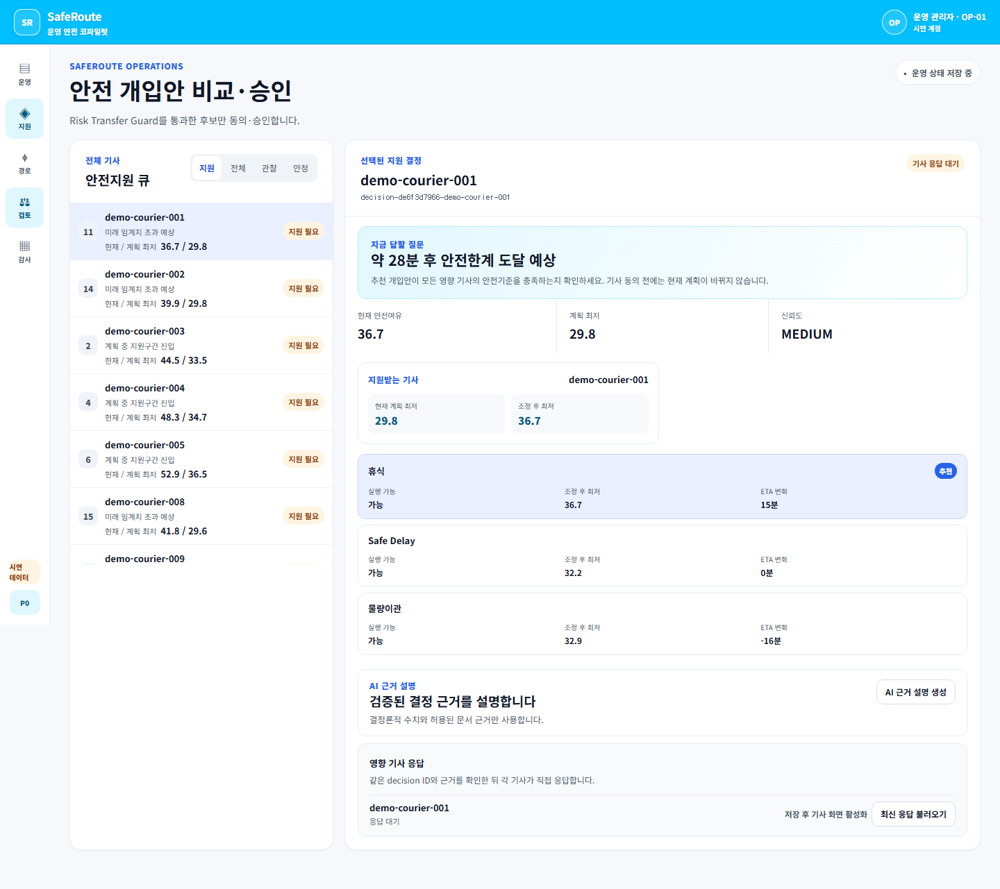

# SafeRoute AI · 김용우 프로젝트 포트폴리오

- 상태: Approved
- 담당: 김용우
- 최종 갱신: 2026-09-06
- 기간: 2026.07~08 대회 프로젝트, 2026.09 포트폴리오 마감
- 결정: 개인 포트폴리오 기술 데모로 종료. 실서비스·사업화 확장 없음.
- 수용기준: 개인 역할, 설계 판단, 코드·실험 근거, 실패와 종료 범위를 함께 제시한다.
- 비목표: 실제 사고 감소·현장 적용 성과 주장, 신규 기능 개발.
- 미결사항: 공개를 막는 항목 없음. 미검증 범위는 아래에 명시한다.

[공개 데모](https://saferoute-ai-demo.khiyw.chatgpt.site/) · [GitHub](https://github.com/khi6174/ai_rookie) · [시연 영상](../output/video/saferoute-ai-final-demo-2026-public-v2-silent.mp4) · [기술 보고서](technical-report.md)

## 프로젝트 요약과 역할

빠른 배송계획도 작업자의 안전여유를 넘을 수 있습니다. SafeRoute AI는 현재 계획을 계속 수행할 때 언제, 어느 배송지에서 운영상 안전한계를 초과하는지 계산하고, 실행 가능한 개입을 비교하는 기술 데모입니다.

2026 AI ROOKIE에 팀명 ‘안전빵’으로 참가했으며, 기획·설계·개발·모델 학습·검증·발표 전 과정을 담당했습니다. 개발과 문서 정리에는 AI 코딩 도구를 활용했습니다. 아래 역할은 프로젝트 전체의 담당 범위이며, 모든 코드를 AI 도움 없이 작성했다는 의미는 아닙니다. 예선 100팀에 선정됐지만 결선에는 진출하지 못했고, 개인 포트폴리오로 마무리했습니다. 예선 진출 결과는 2026-09-06 본인 확인을 근거로 기록합니다.

## 핵심 설계 판단

안전 수치를 설명용 AI가 바꾸지 못하도록 계산과 설명 계층을 분리했습니다. Safety Budget과 Time-to-Breach, 후보 실행 가능성은 결정론적 코드가 소유하고 AI는 검증된 수치와 문서 근거를 설명합니다. 스키마·숫자·인용 검증에 실패하면 Fallback 상태를 표시합니다.

개입은 안전하지 않은 후보를 먼저 제외한 뒤 비교합니다. 물량이관에서는 받는 기사의 안전여유와 실행 조건을 다시 검사합니다. 영향 기사들의 동의와 관리자 승인, 계획 버전 재검증을 거쳐 합성 계획을 적용하고 고객안내 초안과 감사기록까지 연결했습니다.

## 문제 해결 사례: 계획 변경과 고객안내의 일관성

마감 점검에서 전체 테스트가 통과하더라도 물량이관 배송지의 고객안내가 누락될 수 있음을 발견했습니다. 적용 계층이 출발 계획만 조회하는 것이 원인이었습니다. 버전이 변경된 모든 계획의 미완료 배송지를 대상으로 안내를 생성하고, 배송지의 실제 계획 버전과 ETA를 기록하도록 수정했습니다.

합성 재현 사례에서 빠졌던 이관 배송지 4곳을 포함해 출발·수신 계획의 미완료 배송지 16곳에 안내가 생성되는 것을 확인했습니다. UTC 저장값을 현지 시각처럼 잘라 표시하던 문제도 IANA 시간대 기반 날짜·시간 표시로 수정했습니다. 재현 테스트가 기존 코드에서 실패하는 것을 확인한 뒤 수정하고 전체 Gate를 다시 실행했습니다.

[수정 구현](../src/application/apply-plan/index.ts) · [재현 결과](../output/portfolio/2026-09-05/closure-evidence/customer-notice-probe-after.json) · [마감 기록](portfolio-closeout.md)

## 학습과 검증

설명 계약용 합성 상황 600개를 기사·관리자·고객·보고서의 네 관점으로 확장해 2,400건을 구성했습니다. 부모 상황 기준으로 학습 1,800건, 검증 300건, 동결 평가 300건을 분리했습니다. SKT A.X-4.0-Light를 NVIDIA A100 80GB에서 LoRA로 학습한 실행 로그를 보존했습니다. 이는 안전 예측 모델의 현장 정확도나 제품 적용 자격을 뜻하지 않습니다.

[데이터 검증](../artifacts/evals/synthetic-cascade-training-dataset-v2-latest.json) · [학습 실행 로그](../artifacts/evals/local-model-runs/ax-cascade-lora-v2/training-summary.json)

2026-09-05 소프트웨어 마감 검증은 단위·계약 테스트 467/467, 관리자–기사 E2E 70/70, clean start 3/3으로 통과했습니다. 30개 동결 합성 변형의 90회 전략 비교에서 하드 제약 위반은 SafeRoute 0/30, ETA 우선 17/30, 배송 건수 균형 우선 11/30이었습니다. 균형 비교군은 배송 건수의 최대–최소 차이를 최소화하는 구현입니다.

[최종 Gate](../artifacts/evals/final-readiness-latest.json) · [동결 비교 결과](../artifacts/evals/frozen-benchmark-summary.json) · [비교군 구현](../src/evals/frozenBenchmark.ts)

## 기술과 설명 가능한 역량

| 기술 | 이 프로젝트의 적용 근거 |
|---|---|
| React 19·TypeScript·Vite·CSS | 관리자 관제와 기사 PWA, 역할별 화면·상태 연결 |
| Zod·결정론적 TypeScript 엔진 | 입력·AI 출력 계약, 안전 계산, 후보 실행 가능성 검증 |
| 상태기계·버전 검증 | 동의·거절·승인·만료·적용 상태 및 계획 충돌 처리 |
| Vitest·Playwright | 계산 경계·계약·회귀 테스트와 관리자–기사 폐루프 E2E |
| Python·LoRA·A100 | 합성 데이터 분리와 A.X 모델 학습 실행·평가 기록 |
| Git·GitHub·Sites | 제출 태그 보존, 수정 근거 추적, 공개 데모 배포 |

백엔드 직무에는 상태 전이·데이터 계약·변경 일관성 사례로, AI 엔지니어링 직무에는 계산과 설명의 권한 분리·학습 데이터 분리·출력 검증 사례로 설명할 수 있습니다. 실제 대규모 운영 경력으로 확대해서 쓰지 않습니다.

## 실패와 종료 범위

- 합성 데이터와 설정 기반 시뮬레이션이며, 실제 사고 감소나 현장 일반화를 입증하지 않았습니다.
- 물량이관은 소속·작업량·버전 등을 갱신하지만 개별 배송지 ETA·순서·도로 구간을 새로 최적화하지 않습니다.
- 관리자 공간 이해도 Round 3은 3명·0/6 trial·중대 오인 6건으로 실패했습니다. 후속 독립 검토를 완료하지 않았으며 기본 화면은 2D로 유지합니다.
- 실제 인증·TMS 쓰기·고객 메시지 전송은 범위 밖입니다. 공개 화면은 합성 데이터 데모입니다.
- A100 300시간은 실제 누적 사용량을 확인할 근거가 부족해 성과 수치로 사용하지 않습니다.

자동화 테스트를 통과한 부분과 사람이 이해하고 사용할 수 있는지는 별도로 검증해야 한다는 점이 이번 프로젝트의 중요한 학습입니다. 추가 발전 후보는 이관 일정의 일관성과 관리자 이해도 재검토이며, 현재 포트폴리오 종료 범위에 후속 개발을 약속하지 않습니다.

## 면접에서 설명할 쟁점

1. **LLM이 안전 점수를 계산하지 않는 이유:** 설명의 변동이 안전 판정이나 사람의 결정권을 바꾸지 않도록 권한을 분리했습니다.
2. **테스트 통과 후에도 결함이 나온 이유:** 기존 검증이 이관 후 수신 계획의 안내 대상을 충분히 다루지 못했습니다. 실패 재현을 추가하고 적용 계층의 조회 범위를 수정했습니다.
3. **합성 비교 0건 위반의 의미:** 정의한 시나리오와 제약 안에서 구현을 검증한 결과이며, 실제 사고 감소나 모든 상황의 안전 보장은 아닙니다.
